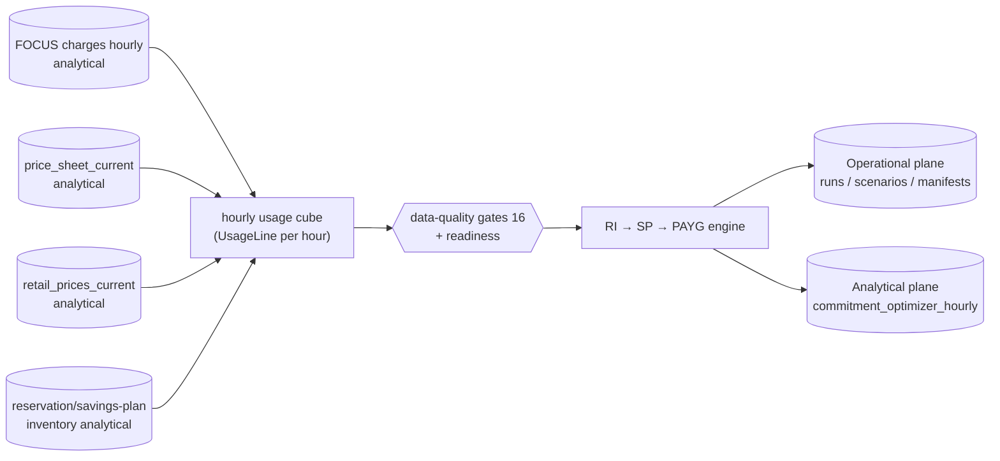

# Azure Commitment Purchase Optimizer

Status: implemented behind a feature flag (2026-08-05). Last reviewed: 2026-08-09.
Algorithm version: `flux-commitment-optimizer-v2`.
Storage: two-plane (operational PostgreSQL + analytical DuckDB snapshots; see §2).

Flux's commitment optimizer recommends an exact, explainable, purchase-ready
portfolio of Azure Reservations, Azure Savings Plans for Compute, and
remaining pay-as-you-go usage. It replaces the directional monthly-equivalent
Savings Plan lane of the right-sizing plan with a genuine **hourly** portfolio
simulation. **Flux never purchases anything**: the output is a versioned
manifest for human execution.

## 1. Implementation note (reuse / extend / deprecate / rollback)

**Reused, unchanged**

- FOCUS ingestion (`focus_import_runs`, `focus_export_manifests`,
  `focus_cost_charges`, `focus_cost_current`) — the only hourly source.
  The optimizer never fabricates hourly rows from daily/monthly amounts.
- Negotiated price sheet ingestion (`store_price_sheet`, `price_sheet_current`)
  — extended with `term` and `effective_date` columns only.
- Reservation inventory + recommendations (`api/commitments.py`,
  `reservation_snapshots`, `reservation_inventory_current`).
- Right-sizing plan boards, confidence rules, exclusions, and the
  `parse_sku` instance-size-flexibility parser.
- Operational store (`api/operational_store.py`) for durable run state;
  DuckDB for rebuildable analytical evidence; sync worker, singleton leases,
  WebJob model, auth dependencies, frontend conventions.

**Extended**

- `api/commitments.py`: Savings Plan order inventory
  (`Microsoft.BillingBenefits/savingsPlanOrders`), Cost Management
  Savings Plan recommendations, and the asynchronous
  `generateBenefitUtilizationSummariesReport` realized-utilization feed.
- `api/jobs.py`: commitments sync now collects SP feeds too; new
  `commitment_optimizer_sync` job + `commitment-optimizer` CLI dispatch.
- `api/config.py` / `.env.example`: `FLUX_COMMITMENT_OPTIMIZER_*` settings.
- `docs/FINOPS-AUDIT-2026-08-05.md` finding F: the draft optimizer's
  economic defects (overage double count, waste omission, ratio stub) were
  corrected in the v2 engine delivered here.

**Deprecated (directional only)**

- The right-sizing plan's per-VM **monthly** SP equivalents
  (`refMonthlyCommitment`, `refMonthlySavings` on the `__savingsplan__`
  lane) remain for planning but are labeled directional; purchase decisions
  must come from an optimizer run. Their meaning is unchanged — no silent
  semantic drift.

**Rollback path**

1. Set `FLUX_COMMITMENT_OPTIMIZER_ENABLED=false` (default). The scheduled
   WebJob exits cleanly, the API returns 409 for new runs, and the UI page
   shows a disabled notice. The navigation entry stays, read-only.
2. Nothing in the existing FOCUS, commitment, price-sheet, or right-sizing
   pipeline depends on optimizer tables; disabling changes no other behavior.
3. Optimizer tables are additive (`commitment_optimization_runs`,
   `commitment_optimizer_scenarios`, `commitment_optimizer_recommendations`,
   `commitment_optimizer_overrides`, `commitment_purchase_manifests`,
   `commitment_optimizer_hourly`, `savings_plan_snapshots`,
   `savings_plan_recommendation_snapshots`, `benefit_utilization_snapshots`).
   No destructive schema rollback is ever required; drop the tables only if
   you also remove the code.
4. Historical FOCUS and commitment data are untouched in every scenario.

## 2. Architecture


Legacy text form (keep for search):
```
FOCUS charges (hourly)          price_sheet_current        reservation_inventory_current
        |                       retail_prices_current      savings_plans_current
        v                                |                          |
  grain detection + currency + exclusion overrides                  |
        |                                                           |
        +------------------ hourly usage cube ----------------------+
        |                     (UsageLine per hour)                  |
        v                                                           v
  data-quality gates (16)  ---------------->  readiness classification
        |
        v
  engine: RI layer (normalized units) -> SP layer ($/hour, discount order) -> PAYG
        |
        v
  portfolios: payg / existing / ri_only / sp_only / blended (+ sensitivity, backtest)
        |
        v
  operational store (runs, scenarios, recommendations, manifests, overrides)
  + DuckDB hourly evidence (commitment_optimizer_hourly)
```

- **Operational plane (PostgreSQL when `FLUX_OPERATIONAL_DATABASE_ENABLED=true`, otherwise operational DuckDB)** remains the system of record for run
  state, approvals, overrides, manifests, throttle state, and snapshot publication ledger
  (`commitment_optimization_runs`, `commitment_optimizer_scenarios`, `commitment_optimizer_recommendations`,
  `commitment_optimizer_overrides`, `commitment_purchase_manifests`, `throttle_state`, `analytics_publications`).
- **Analytical plane (DuckDB — mutable on writer, immutable snapshots on web)** holds only rebuildable analytical artifacts: the hourly
  evidence cube keyed by `run_id` (`commitment_optimizer_hourly`). Web never opens the mutable file when
  `FLUX_ANALYTICS_SNAPSHOT_MODE=snapshot`.
- **No new analytical platform.** No ADX, Fabric, or extra databases.

## 3. Azure APIs and permissions

| Feed | API | Permission | Failure behavior |
|---|---|---|---|
| Reservation inventory | `Microsoft.Capacity/reservations` `2022-11-01` | Reservations Reader (tenant capacity scope) | Actionable grant hint; other feeds continue |
| Reservation recommendations | `Microsoft.Consumption/reservationRecommendations` `2024-08-01` per subscription | Reader | Per-subscription error list |
| Savings Plan inventory | `Microsoft.BillingBenefits/savingsPlanOrders` `2024-11-01` | Reservations Reader | Actionable grant hint |
| SP recommendations | `Microsoft.CostManagement/recommendations` `2024-08-01`, filtered client-side to `kind == savingsplan` | Reader | Per-subscription error list |
| Realized benefit utilization | `generateBenefitUtilizationSummariesReport` (async, Location polling) | Reader + `Microsoft.CostManagement/*/read` | Degrades to warning; gated by `FLUX_COMMITMENT_BENEFIT_UTILIZATION_ENABLED` |

Least privilege: all feeds are read-only. No write permissions are requested
or required. No secrets in logs; provider error messages are truncated and
sanitized by the existing `_http_error_message` helper.

### 3.1 Provisioning the negotiated price sheet export

The optimizer's primary basis (Section 4) is `price_sheet_current`, which is
populated by the `flux-price-sheet` job from a Cost Management **PriceSheet**
export. Without it every run prices from retail, is flagged
`directionalPricing`, and can never produce a purchase manifest.

On an **Enterprise Agreement the export must be created at enrollment scope.**
Subscription-scope price sheet exports are refused with `Unauthorized.
Authentication failed.` before payload validation runs — the pipeline's
per-subscription step fails this way on every subscription by design, and one
enrollment-scope export covers them all.

Create it with:

```powershell
pwsh -File scripts/provision_price_sheet_billing_scope.ps1
```

Run it as a user holding an **EA billing role** (Enterprise Administrator).
Azure grants service principals only read-only enrollment roles, so the
export pipeline's identity cannot create this even though it holds
Cost Management Contributor and Storage Account Contributor — verified
2026-08-07, when it reported seeing no billing account at all. The script
discovers the enrollment, is GET-first and idempotent, and prints `SKIP` if
the export already exists.

**The accepted payload shape** (confirmed live 2026-08-07 against enrollment
`74631236`, api-version `2025-03-01`):

| Field | Value |
|---|---|
| `definition.timeframe` | `TheCurrentMonth` |
| `definition.dataSet` | `configuration.dataVersion` only — **no** `granularity` |
| `schedule.recurrence` | `Daily` |

None of the obvious analogies hold, so do not "fix" this to match a
neighbouring export:

- `MonthToDate` + `Daily` is what the working FOCUS cost export uses against
  this same API, and it is rejected for PriceSheet: the constraint is per
  export type.
- `MonthToDate`, `TheLastMonth`, `TheLastBillingMonth` and
  `BillingMonthToDate` are all refused with *"Invalid timeframe … and schedule
  recurrence … combination"*.
- Microsoft's published `ExportCreateOrUpdateByBillingAccountPricesheet`
  example carries `dataSet.granularity = "Daily"`, which this api-version
  refuses with *"Invalid dataset granularity: 'Daily'"*.

On Windows, `az rest --body $json` sends an **empty body** (`az` is a batch
file and cmd.exe mangles the multi-line argument), surfacing as *"Invalid
request payload: Unexpected end when reading JSON"*. Write the payload to a
UTF8-without-BOM temp file and pass `--body "@file"`. Pipeline runs on Linux
agents never hit this.

After creation Azure writes the first sheet to
`cost-management/pricesheet/enrollment`, `flux-price-sheet` ingests it on its
next daily run (08:50 UTC), and the optimizer switches from retail to
contracted rates on its own.

## 4. Source precedence

1. **Contracted price sheet** (`price_sheet_current`) — primary basis for
   PAYG, Savings Plan, and Reservation rates. `UnitPrice` is the customer's
   negotiated price; reservation rows are amortized over term hours
   (P1Y = 8760, P3Y = 26280); unit-of-measure hour multipliers are parsed.
2. **FOCUS `ContractedUnitPrice`** — fallback PAYG rate when the sheet has
   no consumption row for the meter.
3. **FOCUS list cost** — list basis for the secondary List ESR.
4. **Retail prices** (`retail_prices_current`) — directional fallback only;
   any run priced from retail is flagged `directionalPricing` and can never
   produce a purchase manifest.
5. **Azure recommendation feeds** — reconciliation benchmark only; never
   summed into Flux savings.

Baselines are never mixed: contracted ESR uses the contracted PAYG-equivalent
baseline; list ESR uses the list baseline; both are reported separately.

## 5. Reservation simulation

Per flexibility group and hour:

1. Convert eligible usage to normalized demand:
   `demand_norm[h,g] = Σ quantity × ratio` (ratio = vCPU-proportional ISF
   ratio from `parse_sku`).
2. Apply existing + proposed reservation capacity
   `capacity[g] = Σ quantity × ratio`.
3. `covered = min(demand, capacity)`; uncovered usage flows to the SP/PAYG
   layer pro-rata; software meters never enter the RI layer.
4. Record used/unused capacity every hour (unused capacity in zero-demand
   hours is reported, not hidden).
5. RI cost is flat amortization: `Σ quantity × hourly_rate` per hour.

Exact purchase SKUs come from `integer_decompose`: greedy by lowest
amortized cost per normalized unit, residual filled with the
smallest-overcoverage SKU, and the overcoverage amount is always explicit.

## 6. Savings Plan simulation

A Savings Plan is a fixed hourly monetary commitment `C`, use-it-or-lose-it:

1. Start from usage remaining after Reservations.
2. Eligible lines sorted by discount
   `d = (payg_rate − sp_rate) / payg_rate` (clamped at 0 — a contracted PAYG
   rate below the SP rate manufactures no savings).
3. Consume commitment in SP-cost terms; the marginal line may be partially
   covered, pro-rated by quantity.
4. `waste[h] = C − used[h]`, never carried to another hour.
5. Hourly cost identity: `total[h] = RI_amortized[h] + C + PAYG_residual[h]`
   — covered usage is never charged again.

## 7. Benefit ordering

1. Reservations (normalized units) → 2. Savings Plans (dollars, highest
discount first) → 3. PAYG at contracted rates. RI and SP savings are never
computed independently and added; overlap is simulated. Each usage dollar is
allocated exactly once (asserted by invariant tests).

## 8. Portfolio optimization

Deterministic frontier search, no opaque ML:

1. Hourly normalized demand by flexibility group.
2. RI candidates from demand percentiles (p50–p100) net of existing
   capacity, per group; portfolios parameterized by one percentile level.
3. For each RI portfolio, residual hourly SP-eligible spend breakpoints
   (plus Azure's recommended commitment and the existing commitment) form
   SP candidates.
4. Evaluate PAYG / existing / RI-only / SP-only / blended; keep the
   Pareto frontier on (annualized cost, downside savings).
5. Select by risk profile objective:
   `objective = annualized_cost + waste×w_w + downside_gap×d_w + ri_unused×l_w`.

Risk profiles (configurable in `RISK_PROFILES`, seeded defaults):

| Profile | Min utilization | Max waste | Downside weight | Lock-in weight |
|---|---|---|---|---|
| conservative | 0.90 | 5% | 0.60 | 0.30 |
| balanced | 0.80 | 15% | 0.35 | 0.20 |
| aggressive | 0.70 | 30% | 0.15 | 0.10 |

Sensitivity: demand factors 1.0/0.9/0.8/0.7 → downside savings, negative
window counts. Laddering/deferral: when rightsizing evidence is not
confident, the optimizer emits an explicit `defer` recommendation with the
trigger (`rightsizing_confident`), a proposed review date, and the stated
benefit/cost of waiting instead of buying into an unmodeled baseline.

**Backtesting.** Runs with at least 14 days of hourly evidence split the
window chronologically (final 7 days held out) and backtest the selected
portfolio through `engine.backtest`: in-sample vs holdout savings, holdout
RI/SP utilization, holdout waste, and a `stable` flag (holdout savings
non-negative and at least 25% of in-sample savings). The report is stored in
`summary.backtest`; short lookbacks report no backtest rather than an
overstated one.

**Continuous re-optimization review events.** Every run records advisory
review events in `summary.reviewEvents` (never mutating recommendations):

- `ri_utilization_below_threshold` / `sp_utilization_below_threshold` —
  modeled utilization below
  `FLUX_COMMITMENT_OPTIMIZER_UTILIZATION_REVIEW_THRESHOLD`;
- `commitment_expiring` — existing commitments expiring within
  `FLUX_COMMITMENT_OPTIMIZER_EXPIRY_REVIEW_DAYS`;
- `usage_data_stale` — newest FOCUS evidence older than three days;
- `data_quality_degraded` — readiness BLOCKED or DIRECTIONAL_ONLY;
- `recommendation_changed` — recommended portfolio changed, or annualized
  savings drifted more than
  `FLUX_COMMITMENT_OPTIMIZER_CHANGE_MATERIALITY_PCT` versus the previous
  completed run.

**Laddered purchase planning.** Existing commitments expiring inside the
review horizon surface as explicit recommendation lines: `renew` (with the
expiry date as the proposed date and a re-evaluation note — future prices
are never assumed to hold) or `allow_expiry` when 30-day utilization is
below `FLUX_COMMITMENT_OPTIMIZER_ALLOW_EXPIRY_UTILIZATION`. Expiry
concentration is therefore visible in the purchase plan itself.

## 9. Data-quality gates and purchase readiness

Sixteen gates (`run_data_quality_gates`) classify every run into
`PURCHASE_READY` / `REVIEW_REQUIRED` / `DIRECTIONAL_ONLY` / `BLOCKED`.
Blocking gates: price sheet availability, currency match, unambiguous price
join, FOCUS double-count, software exclusion, baseline mixing, catalog
purchasability. Directional gates: explicit hourly grain, expected hour
count, duplicate hours. Review gates: commitment freshness, flexibility
mappings, rightsizing confidence, usage recency, price effective dates,
minimum-savings threshold.

**Missing hourly series are never synthesized** — no monthly÷hours, no
daily÷24, no inventory-assumed-24×7. A non-hourly FOCUS grain yields a
`DIRECTIONAL_ONLY` run that refuses manifests.

## 10. ESR calculations

- **Contracted ESR** = `(contracted PAYG-equiv baseline − total cost) /
  contracted PAYG-equiv baseline` — the primary metric.
- **List ESR** = `(list PAYG-equiv baseline − total cost) / list baseline`
  — secondary market comparison only.
- Nominal Azure discounts are never presented as realized savings.

## 11. Worked example (complete)

Fixture: one hour, two `Standard_D4s_v5` VMs (ratio 4), region eastus.
Contracted PAYG rate $0.10/VM·h; SP P1Y rate $0.065/VM·h; RI P1Y amortized
$0.05/h per D4 reservation (ratio 4). Existing commitments: none.

**PAYG baseline.** Baseline = 2 × $0.10 = **$0.20**.

**RI-only, one D4 reservation.** Capacity = 4 normalized units; demand =
2 × 4 = 8; covered = 4 (one VM), residual one VM. RI cost $0.05. Residual
PAYG = $0.10. Total = **$0.15**; RI utilization = 4/4 = 100% of the single
reservation's capacity-hour present in the hour; savings = $0.05 (25% ESR).

**Blended: RI + SP commitment $0.065/h.** Residual eligible spend =
1 VM × $0.065 = $0.065 ≤ commitment. SP used $0.065, waste $0, PAYG
residual $0. Total = $0.05 + $0.065 = **$0.115**.

**Checks.** Savings vs baseline = $0.20 − $0.115 = **$0.085**; contracted
ESR = 0.085/0.20 = **42.5%**. Cost identity: 0.05 + 0.065 + 0 = 0.115 ✓.
No usage dollar counted twice: RI covered $0.10 equiv + SP covered $0.10
equiv = full $0.20 baseline ✓.

**Oversized SP stress.** Commitment $0.20/h instead: used $0.065, waste
$0.135, total = $0.05 + $0.20 = $0.25 > baseline — downside scenario
correctly shows negative savings, so conservative profiles reject it.

## 12. Backtesting & reconciliation

- Rolling backtests run automatically inside every qualifying run (see
  section 8): train/holdout split, holdout savings/utilization/waste, and a
  stability flag persisted in `summary.backtest`. A portfolio that only
  performs in one busy window is flagged `stable: false` and its savings
  should be treated as upper-bound.
- Azure reconciliation (`engine.reconcile_with_azure`) compares Flux SP
  commitment and savings against Azure's recommendation values at a
  configurable tolerance (`FLUX_COMMITMENT_RECONCILIATION_TOLERANCE_PCT`,
  default 10%). Unevaluated (missing Azure evidence) is reported as such —
  never silently passed.
- Completed runs compare reproducibly through
  `GET /api/commitments/optimizer/runs/compare?base=&compare=`: deltas for
  annualized cost/savings, contracted ESR, coverage, purchase lines, plus a
  material-change verdict against the configured materiality threshold.

## 13. UI workflow

`Commitment optimizer` page (FinOps section):

1. Summary strip: readiness, recommended portfolio, annual cost before/after,
   annual savings, contracted ESR, coverage, waste; directional-pricing
   banner when the price sheet is absent; backtest stability line and the
   run's advisory review events.
2. Purchase plan tab: exact recommendations (SKU/quantity or $/hour,
   term, scope, expected cost/savings) including laddered `renew`,
   `allow_expiry`, and `defer` lines, with approve/reject for admins.
3. Portfolios tab: full comparison incl. downside savings.
4. Hourly evidence tab: stacked RI-covered / SP-covered / PAYG / waste chart.
5. Gates tab: all 16 data-quality gates with severities.
6. Run history tab: versioned runs with a two-run comparison table
   (deltas + material-change verdict).
7. Admins can rerun with lookback/risk-profile/term and export the manifest
   CSV (refused for BLOCKED/DIRECTIONAL_ONLY runs).

Reruns create new versioned runs; completed runs are immutable.

## 14. API surface

| Method | Route | Purpose |
|---|---|---|
| GET | `/api/commitments/optimizer/status` | Flag, algorithm version, latest run |
| GET | `/api/commitments/optimizer/runs` | Run history |
| POST | `/api/commitments/optimizer/runs` | Admin: execute a run inline (singleton lease) |
| GET | `/api/commitments/optimizer/runs/{id}` | Run + gates + scenarios + recommendations + review events + backtest |
| GET | `/api/commitments/optimizer/runs/{id}/hourly` | Hourly evidence |
| GET | `/api/commitments/optimizer/runs/{id}/manifest?format=json|csv` | Admin: versioned manifest |
| GET | `/api/commitments/optimizer/runs/compare?base=&compare=` | Reproducible delta between two completed runs |
| PUT | `/api/commitments/optimizer/recommendations/{id}/decision` | Admin: approve/reject |
| PUT | `/api/commitments/optimizer/overrides` | Admin: resource exclusions etc. |

## 15. Scheduling

WebJob `flux-commitment-optimizer` daily at 05:30 UTC (singleton), flag-gated.
Manual runs via API or `python -m api.jobs commitment-optimizer`. Failed
refreshes never disturb the last good run; the UI keeps serving it.

## 16. Security & privacy

Tenant isolation via the existing single-integration model; admin-only
mutations; audit columns on decisions and manifests (`decision_by`,
`generated_by`); manifest content hashes; no billing-account identifiers
exposed beyond existing surfaces; exports require admin.

## 17. Testing

- `tests/test_commitment_optimizer.py` — 41 engine tests covering the
  mandatory economic rules: RI-before-SP ordering, highest-discount-first,
  waste never rolls, overage, flexibility ratios, integer decomposition,
  contracted-below-SP-rate, cost identities, double-coverage prevention,
  reproducibility, gates, reconciliation, DST/UTC hour safety, backtest
  train/holdout semantics, and the capacity/waste/cost invariants.
- `tests/test_commitment_optimizer_pipeline.py` — 22 end-to-end tests over a
  seeded governed DuckDB: purchase-ready run, blocked/directional refusals,
  daily-grain detection, duplicate hours, expired SP exclusion, decisions,
  overrides, versioning, backtest presence/absence, expiry-driven
  renew/allow-expiry laddering, stale-data and data-quality review events,
  material-change detection, rightsizing-limited purchase readiness
  (case 15), exclusion-reduced purchases (case 14), and run comparison.
- Full suite: 472 tests, OK (skipped=5).

## 18. Performance

Benchmarked with `python -m scripts.benchmark_commitment_optimizer`
(Windows dev host, DuckDB 1.4.5, single worker):

| Workload | Scale | Result |
|---|---|---|
| Full pipeline run | 60 days x 200 VMs = 288,000 hourly charges | PURCHASE_READY blended portfolio in 44.3s (seed 3.3s) |
| Engine simulation | 365 days x 175,200 usage rows (8,760 hours, 25 flexibility groups) | simulate 1.1s, 4-factor sensitivity 6.4s |

The hourly cube is built with pushdown SQL against `focus_cost_current`
(only the run window is scanned); portfolio simulation is linear in
usage-row count and never loads unbounded history into application memory
beyond the selected lookback. Runs execute through the singleton lease
(WebJob or admin-triggered inline), so a long run cannot overlap another
run or an Azure sync write.

## 19. Operational troubleshooting

| Symptom | First check |
|---|---|
| Run BLOCKED, `price_sheet_available` | Price sheet export job (`flux-price-sheet`) and blob prefix; if the job logs "No price sheet manifests found", the export itself is missing — see Section 3.1 |
| Run DIRECTIONAL_ONLY, `hourly_grain_explicit` | FOCUS export granularity — must be hourly, not daily |
| `commitments_current` failing | `flux-commitments` job output; Reservations Reader role |
| SP recommendations empty | Cost Management recommendations availability per subscription; API version note in Section 3 |
| Manifest refused | Run readiness — manifests require PURCHASE_READY or REVIEW_REQUIRED |
| `commitment_expiring` review events | Reservation/SP inventory feed freshness; verify expiry dates in Azure |
| No backtest in summary | Lookback shorter than 14 days — expected, not a fault |

## 20. Operational notes

- **Build:** `2.0.0` + `ca66a85` (`version.json` stamped in `azure-pipelines.yml` → `settings.build_commit` → `GET /api/health` `commit`).
- **Pipeline safety-net** (`72bfcdd`): `azure-pipelines.yml` reapplies `FLUX_HOST=0.0.0.0`, `FLUX_PORT=8000`, `WEBSITE_SKIP_RUNNING_KUDUAGENT=false`, `FLUX_AUTH_MODE=entra` on every deploy; preview/prod artifacts remain vendor-portable (`manylinux_2_28`).
- **Ports & plane:** dev `8765` / Rill `8786` / prod `8000`; runs/scenarios/manifests are operational (PostgreSQL advisory-locked writer), `commitment_optimizer_hourly` is analytical snapshot-published — web never opens the mutable DuckDB when `FLUX_ANALYTICS_SNAPSHOT_MODE=snapshot`.
- **Snapshot mode:** `focus_cost_current` hourly cube is read via the analytics snapshot; FOCUS double-count and stale `cost_anomaly` gates correctly flag the run `DIRECTIONAL_ONLY` when history lags.

## 21. Known limitations

1. Instance-flexibility ratios are vCPU-proportional approximations from SKU
   names; region-specific Microsoft ratio tables are not yet ingested.
2. The SP layer prices meters from the price sheet by meter id; meters
   missing from the sheet fall back to FOCUS list rates (flagged
   directional) or drop out of the SP layer.
3. Laddering is rule-based (expiry-aligned renew/allow-expiry lines plus
   rightsizing deferral triggers), not a multi-period stochastic program;
   tranche sizes are the existing recommendation granularity.
4. The realized-utilization feed is optional and asynchronous; reconciliation
   degrades to "unevaluated" without it.
5. Scope modeling is Shared-first; subscription-scoped SP/RI simulation uses
   the same engine with scope metadata carried, but per-scope demand
   partitioning is not separately priced yet.
6. Review events are advisory and stored in the run summary; they do not yet
   push to an external notification destination.
