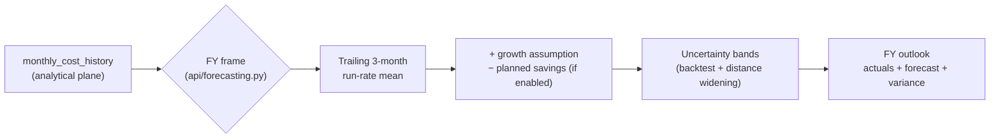

# Financial planning forecast method

Last reviewed: 2026-08-09
Implementation: `api/forecasting.py` (`post-migration-run-rate-v1` primary, `seasonal-yoy-comparison-v1` comparison)
Operational state: budget groups and assumptions on the operational plane; `daily_cost_history` / `monthly_cost_history` on the analytical plane

## Primary method

Financial Planning now uses `post-migration-run-rate-v1` as the executive fiscal-year forecast.

The forecast:

- carries completed months through as actuals;
- estimates the in-progress month from the current-month estimate when available;
- uses the average of the three most recent complete months as the post-migration run-rate for future months;
- applies the user-recorded monthly growth assumption, if any;
- subtracts planned right-sizing savings only when explicitly enabled in assumptions;
- calculates uncertainty bands from backtesting the same trailing-mean rule and widens them with forecast distance.

This is intentionally not a "before cloud migration versus now" comparison. It estimates the estate's current operating trajectory from the period after the migration, which is the decision-relevant baseline for future rightsizing, reservations, savings plans, and other approved actions.

## Two-plane note
## Two-plane note
- `monthly_cost_history` and `daily_cost_history` are analytical (DuckDB, snapshot-published via `analytics_publications`). Web reads the last approved snapshot; the writer alone holds the mutable file.
- Budget groups, growth assumptions, and planned-savings flags are operational (PostgreSQL / operational DuckDB) and survive snapshot restores.
- A stale or missing analytical snapshot means the forecast is computed from the last approved ledger — the UI discloses the ledger's as-of date and does not silently fall back to an older growth assumption.

## Operational notes

- **Build:** `2.0.0` + `ca66a85` (`version.json` → `settings.build_commit`).
- **Pipeline safety-net:** `azure-pipelines.yml` reapplies `FLUX_HOST=0.0.0.0`, `FLUX_PORT=8000`, `WEBSITE_SKIP_RUNNING_KUDUAGENT=false`, `FLUX_AUTH_MODE=entra` on every deploy.
- **Ports:** dev `8765` / Rill `8786` / prod `8000` (see `docs/architecture.md`).

## Seasonal comparison

The former method is retained as `seasonal-yoy-comparison-v1` (`api/forecasting.py: FY_SEASONAL_METHOD_VERSION`). It uses the same month from the prior year, scaled by a trailing year-over-year factor, with a trailing-mean fallback. It is returned as `seasonalComparison` for context only and is not used for the executive total, chart, budget variance, or planning pulse.

The UI labels this comparison as "not used for executive forecast," and the exported assumptions sheet includes its FY total as a reference value.

## Why the change was made

The prior model could compare current cloud months with periods before the data-center migration. That created large artificial declines in months whose prior-year values represented a different operating model, making the forecast difficult to explain in an IT Leadership meeting. A trailing post-migration run-rate is more honest while the estate is still establishing a stable cloud baseline.

## Daily forecast

`forecast_daily_cost` in the same module powers the cost-summary trend forecast (30-day and calendar-month horizon). The caller excludes the most recent `FLUX_COST_ANOMALY_LATENCY_DAYS` (default 2) billing-finalization days before forecasting; the forecast is therefore not a restatement of in-flight billing.

## Limitations and review points

The run-rate is not a causal savings forecast. It does not claim that spending will fall without an approved action. It also remains sensitive to an incomplete cost-history backfill, migration activity in the trailing window, one-time projects, and the selected monthly growth or planned-savings assumptions. Coverage warnings and recorded assumptions remain part of the forecast response and export.

Credits, refunds, and corrections are currently clamped to zero in the daily/monthly forecast model (see `FINOPS-AUDIT-2026-08-05.md` P2-5); they are therefore not projected. Forecast gross vs. net separation is a tracked enhancement.

Anomaly-flagged spikes inside the trailing 3-month window can inflate the run-rate; operators should cross-check the cost-anomaly report before locking a forecast.
