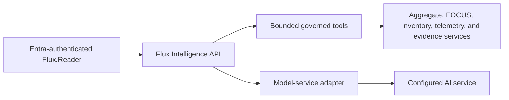

# Flux Intelligence

Last reviewed: 2026-07-26

Flux Intelligence is the umbrella for FluxFinOps intelligence features:

- **Ask Flux** is the read-only conversational assistant.
- **Flux Signals** is the deterministic, versioned optimization rule engine.
- **Governed intelligence tools** are the bounded report and evidence services
  used by Ask Flux.

Ask Flux investigates cloud cost, inventory, telemetry, governance, anomaly,
and optimization data already governed by FluxFinOps.

## User experiences

- **Ask Flux** opens as a right-side panel from any authenticated page.
- **Intelligence Workspace** provides a full-page investigation experience.
- Both experiences share the same in-memory conversation until the page is
  refreshed or the user clears it.
- Responses can contain safe Markdown, governed Recharts specifications, and
  strict Mermaid diagrams.

## Architecture and authorization



The model does not receive a database connection, Azure credential, Rill
endpoint, or arbitrary query interface. It can invoke only declared server-side
tools. Each tool validates and bounds its arguments before calling existing Flux
application services.

The existing `Flux.Reader` application role is required. `Flux.Admin` inherits
read access. No assistant-specific user authorization model is introduced.

## Analysis profiles

| Profile | Purpose |
|---|---|
| Fast | Default contextual and workspace interactions |
| Deep analysis | Quality, latency, reliability, and cost comparison |

The model service is hidden behind an adapter and configured through secure
environment settings. UI and governed tools are not coupled to a named model.

Two provider adapters are available:

| Provider | Setting | Default fast model | Default deep model |
|---|---|---|---|
| **OpenRouter** (default) | `FLUX_AI_PROVIDER=openrouter` | `google/gemini-2.5-flash-lite` ($0.10/$0.40 per M) | `openai/gpt-4.1-mini` ($0.40/$1.60 per M) |
| DeepSeek (backward-compat) | `FLUX_AI_PROVIDER=deepseek` | `deepseek-v4-flash` | `deepseek-v4-pro` |

The OpenRouter provider routes to cost-effective non-Chinese models through
the OpenRouter API (`https://openrouter.ai/api/v1/chat/completions`). The API
key (`FLUX_OPENROUTER_API_KEY`) is stored as an App Service Key Vault reference
and must never be passed through the pipeline `appSettings` parameter (which
would wipe it on every deploy). Non-secret settings are applied additively via
`az webapp config appsettings set` to preserve Key Vault references.

## Data and retention

- The active conversation exists in browser state until refresh or clear.
- Prompts, validated replies, request context, and raw final responses are
  retained in DuckDB for 30 days for administrator quality review.
- Model reasoning is never retained.
- Metadata-only usage events are retained for 30 days: pseudonymous user hash,
  connection/model identifiers, status, latency, token counts, estimated cost, invoked tool
  names, error category, and optional helpful/not-helpful feedback.
- The configured AI service is an external processor. Tool results required to
  answer a question are transmitted to that service.
- Transcript retention is controlled by
  `FLUX_AI_TRANSCRIPT_RETENTION_DAYS`; setting it to `0` disables storage.

## Performance path

The measured path is:

1. browser request and Entra/App Service ingress;
2. FastAPI orchestration;
3. governed Flux tool calls;
4. DuckDB and native report services for data tools;
5. AI analysis, which can alternate with tool calls;
6. structured response validation;
7. API response transport and browser render.

Repeated identical read-tool requests are cached in-process for 30 seconds by
default; cache hits are visible in per-tool performance details. Cost-change
investigations can use one composite tool that returns independent daily-history
and FOCUS charge evidence, reducing model round trips without blending their
coverage claims.

Rill is not used by Ask Flux requests. Per-answer details show model,
tool, DuckDB/report, application, validation, combined network/ingress, and
browser-render timing. The workspace reports 30-day average and p95
browser-to-render duration. Network and App Service ingress remain a combined
measurement until distributed tracing is introduced.

Responses above `FLUX_AI_SLOW_REQUEST_MS` display the largest measured stage.
Administrators can expand the workspace quality review to inspect retained
prompts, validated summaries, feedback, response modes, slow-request counts,
and stage bottlenecks without accessing model reasoning.

## Spending control

- Evaluation budget: USD 10.
- Automatic stop/report ceiling: USD 8.
- Cost is estimated from service-reported token counts and configured model
  rates.
- Fast is the default; deep analysis requires an explicit UI selection.

## Output controls

- The system prompt requires a strict JSON response contract.
- Markdown raw HTML is not rendered.
- Charts are limited to line, bar, or area charts with bounded rows and series.
- Mermaid uses strict security mode; click directives, custom classes, and HTML
  are rejected.
- Retrieved facts, interpretations, limitations, and tool sources are distinct.
- Tool outputs are marked as data, not instructions.
- Each validated response receives a deterministic 0–100 quality score.
  Checks cover structured output, governed-source grounding, retrieved facts,
  required partial-coverage disclosure, follow-up perspective, Markdown table
  validity, and summary completeness.
- Page links are generated by the Flux server from invoked tool names; the
  model cannot choose arbitrary application destinations.

## Governed cost investigation

- `get_cost_summary` provides daily actual/amortized trends, period comparison,
  forecast, and aggregate breakdowns.
- `get_focus_cost` provides charge-level billed/effective/contracted/list cost,
  purchases, commitments, pricing categories, SKUs, meters, resources, manifest
  lineage, and explicit export coverage.
- `investigate_cost_change` returns both contracts in one bounded tool call.
- FOCUS and daily-history coverage remain independent. Missing CSP export
  scopes must be stated before any total.
- Missing or zero CSP contracted/list fields never become inferred savings.

## Known limitations

- Responses may be incomplete, slow, or incorrect.
- Automatic model-service failover is not implemented.
- The spending ceiling is an application-level control, not a service billing
  account limit.
- The assistant has no cloud mutation capability.
- The documentation tool searches only an approved FluxFinOps allowlist.
- Stakeholder-authored evaluation questions are still required; the current
  evaluation set is engineering-authored.

## Evaluation

The seed suite is in
`evaluations/flux-intelligence.json`. It covers cost, forecasting,
anomalies, optimization, telemetry, inventory, governance, documentation,
clarification, prompt injection, write requests, and credential requests.

Run a bounded profile comparison only when a backend credential is supplied:

```powershell
# Supply the configured backend credential through the secure runtime environment.
python scripts/benchmark_flux_intelligence.py --limit 5
```

The runner prints aggregate outcomes. Application transcript retention follows
the configured runtime setting.

## Hardening boundary

Model-service procurement, formal privacy review, adversarial evaluation,
service failover, durable
conversation governance, stronger distributed budget enforcement, and
stakeholder acceptance criteria remain release-hardening work.
