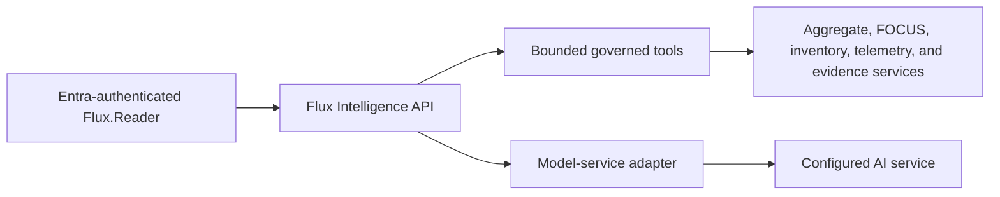

<p align="center">
  
</p>

# Flux Intelligence

Last reviewed: 2026-08-04

Flux Intelligence is the umbrella for FluxFinOps intelligence features:

- **Ask Flux** is the read-only conversational assistant.
- **Flux Signals** is the deterministic, versioned optimization rule engine.
- **Governed intelligence tools** are the bounded report and evidence services
  used by Ask Flux.

Ask Flux investigates cloud cost, inventory, telemetry, governance, anomaly,
and optimization data already governed by FluxFinOps.

## User experiences

- **Ask Flux** opens as a right-side panel from any authenticated page.
- **Intelligence Workspace** provides a full-page investigation experience.
- Both experiences share the same in-memory conversation until the page is
  refreshed or the user clears it.
- Responses can contain safe Markdown, governed Recharts specifications, and
  strict Mermaid diagrams.

## Architecture and authorization



The model does not receive a database connection, Azure credential, Rill
endpoint, or arbitrary query interface. It can invoke only declared server-side
tools. Each tool validates and bounds its arguments before calling existing Flux
application services.

The existing `Flux.Reader` application role is required. `Flux.Admin` inherits
read access. No assistant-specific user authorization model is introduced.

## Governed tool catalog

Nineteen tools are declared. A reply lists every tool it invoked, so any number
in an answer can be traced to the governed service that produced it. Tools that
search are bounded (50 results); `FLUX_AI_MAX_TOOL_CALLS` (default 12) bounds
how many calls one answer may make.

### Cost and billing

| Tool | Returns |
|---|---|
| `get_cost_summary` | Actual or amortized cost summary, trends, breakdowns, movers, forecast, and lineage |
| `get_focus_cost` | FOCUS charge-level billed, effective, contracted, and list cost with service, pricing, commitment, SKU, meter, resource, and manifest lineage |
| `investigate_cost_change` | Daily comparison and FOCUS charge drivers in one request — the preferred entry point for "why did this change?" |
| `get_cost_anomalies` | Seasonal anomaly findings and aggregate evaluation status |
| `get_fiscal_year_outlook` | Fiscal-year actuals to date, projected remaining months with confidence bounds, and budget variance |
| `get_commitment_inventory` | Active reservations: SKU, region, quantity, term, scope, 1/7/30-day utilization, and expiry |
| `get_virtual_tag_showback` | Virtual-tag dimensions, classified and unclassified cost, monthly history, and assignment provenance |

### Optimization and right-sizing

| Tool | Returns |
|---|---|
| `search_opportunities` | Advisor and Flux Signals findings with valuation and evidence metadata |
| `get_workload_optimization` | Workload optimization report: value, confidence, coverage gaps, aging, top opportunities |
| `get_rightsizing_recommendations` | Deterministic right-sizing and idle findings for many resources, with current and target SKU |
| `get_rightsizing_dossier` | The complete evidence dossier for **one** VM as a resize candidate, across every telemetry source |
| `get_rightsizing_plan` | The human-owned purchase plan: commitment buckets, planned quantities, planner-entered economics, and decisions |
| `create_rightsizing_board` | Creates a new empty planning board — see [Mutation boundary](#mutation-boundary) |

### Inventory, telemetry, and governance

| Tool | Returns |
|---|---|
| `search_inventory` | Current Azure inventory from governed snapshots |
| `get_resource_telemetry` | Azure Monitor and LogicMonitor summaries for one exact resource ID |
| `get_fleet_telemetry` | Utilization (CPU, memory, network, coverage) plus actual cost for many resources at once |
| `get_governance_posture` | Azure Policy compliance posture and resource drilldown |

### Reference

| Tool | Returns |
|---|---|
| `get_report_catalog` | Approved reports, measures, dimensions, filters, lineage, and guardrails |
| `search_documentation` | The approved FluxFinOps documentation allowlist and, when configured, the company wiki's FluxFinOps articles |

## Mutation boundary

Ask Flux has **no cloud mutation capability**: it cannot start, stop, resize,
delete, tag, or purchase anything in Azure, and it cannot write to the
analytical store.

One tool does create Flux application state. `create_rightsizing_board` creates
a new, empty planning board — a scratch space for a scenario such as
"Aggressive downsize option". Its constraints are deliberate: the new board is
never primary, never affects the fiscal outlook, and the tool may only be called
after the user has explicitly confirmed the exact board name in a later message.
Existing boards, placements, and decisions remain human-owned; the assistant
cannot alter them.

## Analysis profiles

| Profile | Purpose |
|---|---|
| Fast | Default contextual and workspace interactions |
| Deep analysis | Quality, latency, reliability, and cost comparison |

The model service is hidden behind an adapter and configured through secure
environment settings. UI and governed tools are not coupled to a named model.

Three provider adapters are available, selected with `FLUX_AI_PROVIDER` and
switchable at runtime by an administrator under **Administration → AI**:

| Provider | `FLUX_AI_PROVIDER` | Default fast model | Default deep model |
|---|---|---|---|
| **DeepSeek** (default) | `deepseek` | `deepseek-v4-flash` | `deepseek-v4-pro` |
| **OpenRouter** | `openrouter` | `google/gemini-2.5-flash-lite` | `openai/gpt-4.1-mini` |
| **Azure AI Foundry** | `foundry` | deployment name (no default) | deployment name (no default) |

Provider notes:

- **DeepSeek** calls `https://api.deepseek.com` with `FLUX_DEEPSEEK_API_KEY`.
- **OpenRouter** routes to cost-effective models through
  `https://openrouter.ai/api/v1` with `FLUX_OPENROUTER_API_KEY`.
- **Azure AI Foundry** keeps traffic inside an Azure resource. Set
  `FLUX_FOUNDRY_ENDPOINT`, `FLUX_FOUNDRY_API_KEY`, and the deployment names in
  `FLUX_FOUNDRY_CHAT_MODEL` / `FLUX_FOUNDRY_BENCHMARK_MODEL`; the OpenAI-shaped
  route uses `FLUX_FOUNDRY_API_VERSION` (default `2024-05-01-preview`). Claude
  deployments on Foundry are served through a separate Anthropic-Messages-
  compatible route: the adapter derives it from the endpoint by swapping a
  trailing `/models` for `/anthropic`, and
  `FLUX_FOUNDRY_ANTHROPIC_ENDPOINT` / `FLUX_FOUNDRY_ANTHROPIC_API_VERSION`
  override that only when the guess is wrong for the resource.

Every provider API key is stored as an App Service Key Vault reference and must
never be passed through the pipeline `appSettings` parameter (which would wipe
it on every deploy). Non-secret settings are applied additively via
`az webapp config appsettings set` to preserve Key Vault references.

## Data and retention

- The active conversation exists in browser state until refresh or clear.
- Prompts, validated replies, request context, and raw final responses are
  retained in DuckDB for 30 days for administrator quality review.
- Model reasoning is never retained.
- Metadata-only usage events are retained for 30 days: pseudonymous user hash,
  connection/model identifiers, status, latency, token counts, estimated cost, invoked tool
  names, error category, and optional helpful/not-helpful feedback.
- The configured AI service is an external processor. Tool results required to
  answer a question are transmitted to that service.
- Transcript retention is controlled by
  `FLUX_AI_TRANSCRIPT_RETENTION_DAYS`; setting it to `0` disables storage.

## Performance path

The measured path is:

1. browser request and Entra/App Service ingress;
2. FastAPI orchestration;
3. governed Flux tool calls;
4. DuckDB and native report services for data tools;
5. AI analysis, which can alternate with tool calls;
6. structured response validation;
7. API response transport and browser render.

Repeated identical read-tool requests are cached in-process for 30 seconds by
default; cache hits are visible in per-tool performance details. Cost-change
investigations can use one composite tool that returns independent daily-history
and FOCUS charge evidence, reducing model round trips without blending their
coverage claims.

Rill is not used by Ask Flux requests. Per-answer details show model,
tool, DuckDB/report, application, validation, combined network/ingress, and
browser-render timing. The workspace reports 30-day average and p95
browser-to-render duration. Network and App Service ingress remain a combined
measurement until distributed tracing is introduced.

Responses above `FLUX_AI_SLOW_REQUEST_MS` display the largest measured stage.
Administrators can expand the workspace quality review to inspect retained
prompts, validated summaries, feedback, response modes, slow-request counts,
and stage bottlenecks without accessing model reasoning.

## Spending control

- Evaluation budget: USD 10.
- Automatic stop/report ceiling: USD 8.
- Cost is estimated from service-reported token counts and configured model
  rates.
- Fast is the default; deep analysis requires an explicit UI selection.

## Output controls

- The system prompt requires a strict JSON response contract.
- Markdown raw HTML is not rendered.
- Charts are limited to line, bar, or area charts with bounded rows and series.
- Mermaid uses strict security mode; click directives, custom classes, and HTML
  are rejected.
- Retrieved facts, interpretations, limitations, and tool sources are distinct.
- Tool outputs are marked as data, not instructions.
- Each validated response receives a deterministic 0–100 quality score.
  Checks cover structured output, governed-source grounding, retrieved facts,
  required partial-coverage disclosure, follow-up perspective, Markdown table
  validity, and summary completeness.
- Page links are generated by the Flux server from invoked tool names; the
  model cannot choose arbitrary application destinations.

## Governed cost investigation

- `get_cost_summary` provides daily actual/amortized trends, period comparison,
  forecast, and aggregate breakdowns.
- `get_focus_cost` provides charge-level billed/effective/contracted/list cost,
  purchases, commitments, pricing categories, SKUs, meters, resources, manifest
  lineage, and explicit export coverage.
- `investigate_cost_change` returns both contracts in one bounded tool call.
- FOCUS and daily-history coverage remain independent. Missing CSP export
  scopes must be stated before any total.
- Missing or zero CSP contracted/list fields never become inferred savings.

## Known limitations

- Responses may be incomplete, slow, or incorrect.
- Automatic model-service failover is not implemented.
- The spending ceiling is an application-level control, not a service billing
  account limit.
- The assistant has no cloud mutation capability.
- The documentation tool searches only an approved FluxFinOps allowlist.
- Stakeholder-authored evaluation questions are still required; the current
  evaluation set is engineering-authored.

## Evaluation

The seed suite is in
`evaluations/flux-intelligence.json`. It covers cost, forecasting,
anomalies, optimization, telemetry, inventory, governance, documentation,
clarification, prompt injection, write requests, and credential requests.

Run a bounded profile comparison only when a backend credential is supplied:

```powershell
# Supply the configured backend credential through the secure runtime environment.
python scripts/benchmark_flux_intelligence.py --limit 5
```

The runner prints aggregate outcomes. Application transcript retention follows
the configured runtime setting.

## Hardening boundary

Model-service procurement, formal privacy review, adversarial evaluation,
service failover, durable
conversation governance, stronger distributed budget enforcement, and
stakeholder acceptance criteria remain release-hardening work.
