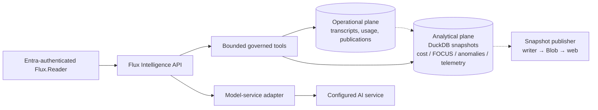

<p align="center">
  
</p>

# Flux Intelligence

Last reviewed: 2026-08-09
Provider config: `api/config.py` `FLUX_AI_PROVIDER` / `api/intelligence_assistant.py`
Report catalog: `api/report_catalog.py` version `2026-08-04.1`

Flux Intelligence is the umbrella for FluxFinOps intelligence features:

- **Ask Flux** is the read-only conversational assistant.
- **Flux Signals** is the deterministic, versioned optimization rule engine (`api/intelligence.py`, `FLUX_INTELLIGENCE_RULE_VERSION = 2026-07-25.4`).
- **Governed intelligence tools** are the bounded report and evidence services used by Ask Flux.

Ask Flux investigates cloud cost, inventory, telemetry, governance, anomaly, and optimization data already governed by FluxFinOps.

## Two-plane storage behind Ask Flux

| Plane | Holds | Ask Flux touches |
|---|---|---|
| **Operational plane** (PostgreSQL when `FLUX_OPERATIONAL_DATABASE_ENABLED=true`, otherwise operational DuckDB) | `intelligence_transcript_events`, `intelligence_usage_events`, `analytics_publications` (snapshot ledger), `analytics_apply_jobs`, `throttle_state` | Writes transcript/usage metadata; reads publication version for lineage |
| **Analytical plane** (DuckDB — mutable on writer, immutable snapshots on web) | `daily_cost_history`, `focus_cost_charges`, `cost_anomaly_snapshots`, `telemetry_metric_summaries`, `resource_snapshots`, `opportunity_*`, `virtual_tag_*` derived views | Governed tools query evidence here (via snapshots when `FLUX_ANALYTICS_SNAPSHOT_MODE=snapshot`) |

The writer owns the mutable DuckDB file; web instances read immutable snapshots (`api/analytics_snapshot.py`). A stale or missing snapshot means Ask Flux returns evidence from the last approved snapshot and discloses the freshness in its limitation — it never silently mixes planes.

## User experiences

- **Ask Flux** opens as a right-side panel from any authenticated page.
- **Intelligence Workspace** provides a full-page investigation experience.
- Both experiences share the same in-memory conversation until the page is refreshed or the user clears it.
- Responses can contain safe Markdown, governed Recharts specifications, and strict Mermaid diagrams.

## Architecture and authorization


```mermaid
flowchart LR
    User["Entra-authenticated Flux.Reader"] --> API["Flux Intelligence API"]
    API --> Tools["Bounded governed tools"]
    Tools --> Op[("Operational plane\ntranscripts, usage, publications")]
    Tools --> Anal[("Analytical plane\nDuckDB snapshots\ncost / FOCUS / anomalies / telemetry")]
    API --> Adapter["Model-service adapter"]
    Adapter --> Model["Configured AI service"]
    Anal -.-> Snapshot["Snapshot publisher\nwriter → Blob → web"]
    Op -.-> Anal
```

The model does not receive a database connection, Azure credential, Rill endpoint, or arbitrary query interface. It can invoke only declared server-side tools. Each tool validates and bounds its arguments before calling existing Flux application services.

<details open>
<summary>Diagram: one Ask Flux request, end to end</summary>

```mermaid
sequenceDiagram
    actor User
    participant UI as Ask Flux panel
    participant API as Flux Intelligence API
    participant Tools as Governed tools
    participant Op as Operational plane
    participant Anal as Analytical plane (snapshot)
    participant Model as Configured AI service

    User->>UI: Question
    UI->>API: POST /api/intelligence/chat
    API->>API: Authorize Flux.Reader · check spend ceiling
    API->>Model: Question + declared tool schemas
    loop Bounded by FLUX_AI_MAX_TOOL_CALLS (12)
        Model-->>API: Requested tool + arguments
        API->>Tools: Validate and bound arguments
        Tools->>Anal: Governed snapshot query
        Anal-->>Tools: Rows with coverage metadata
        Tools-->>Model: Tool result marked as data
    end
    Model-->>API: Structured JSON response
    API->>API: Validate contract · score quality 0-100
    API->>Op: Retain transcript and usage metadata
    API->>Anal: (read-only evidence; never writes)
    API-->>UI: Summary, blocks, facts, limitations, sources
    UI->>API: POST /api/intelligence/performance
```

</details>

The model never appears between `Tools` and `Data`: it names a tool, and the server decides whether that call is legal and what it may touch.

The existing `Flux.Reader` application role is required. `Flux.Admin` inherits read access. No assistant-specific user authorization model is introduced.

## Governed tool catalog

Nineteen tools are declared. A reply lists every tool it invoked, so any number in an answer can be traced to the governed service that produced it. Tools that search are bounded (50 results); `FLUX_AI_MAX_TOOL_CALLS` (default 12) bounds how many calls one answer may make.

### Cost and billing

| Tool | Reads from | Returns |
|---|---|---|
| `get_cost_summary` | `daily_cost_history` (analytical) + `focus_cost_current` lineage | Actual or amortized cost summary, trends, breakdowns, movers, forecast, and lineage |
| `get_focus_cost` | `focus_cost_charges` + `focus_export_manifests` (analytical) | FOCUS charge-level billed, effective, contracted, and list cost with service, pricing, commitment, SKU, meter, resource, and manifest lineage |
| `investigate_cost_change` | `daily_cost_history` + `focus_cost_charges` (analytical) | Daily comparison and FOCUS charge drivers in one request — the preferred entry point for "why did this change?" |
| `get_cost_anomalies` | `cost_anomaly_snapshots` + subscription/service ledger (analytical) | Seasonal anomaly findings (`cost-seasonal-mad-v1`, k-score, MAD), aggregate status, and lineage |
| `get_fiscal_year_outlook` | `monthly_cost_history` + forecast engine (analytical) | Fiscal-year actuals to date, projected remaining months with confidence bounds (`post-migration-run-rate-v1` primary, `seasonal-yoy-comparison-v1` comparison), and budget variance |
| `get_commitment_inventory` | Reservation/SP inventory snapshots (analytical) + operational commitments | Active reservations: SKU, region, quantity, term, scope, 1/7/30-day utilization, and expiry |
| `get_virtual_tag_showback` | `virtual_tag_*` effective views (operational rules → analytical allocation) | Virtual-tag dimensions, classified and unclassified cost, monthly history, and assignment provenance |

### Optimization and right-sizing

| Tool | Reads from | Returns |
|---|---|---|
| `search_opportunities` | `opportunity_confidence_snapshots` + `opportunity_valuation_snapshots_v2` (analytical) | Advisor and Flux Signals findings with confidence and valuation metadata |
| `get_workload_optimization` | Workload report services (analytical) | Workload optimization report: value, confidence, coverage gaps, aging, top opportunities |
| `get_rightsizing_recommendations` | `rightsizing_recommendation_snapshots` + telemetry summaries (analytical) | Deterministic right-sizing and idle findings for many resources, with current and target SKU |
| `get_rightsizing_dossier` | Single-resource telemetry + cost evidence (analytical) | The complete evidence dossier for **one** VM as a resize candidate, across every telemetry source |
| `get_rightsizing_plan` | Rightsizing plan boards (operational) + retail prices (analytical) | The human-owned purchase plan: commitment buckets, planned quantities, planner-entered economics, and decisions |
| `create_rightsizing_board` | Operational plane (writes `rightsizing_boards`) | Creates a new empty planning board — see [Mutation boundary](#mutation-boundary) |

### Inventory, telemetry, and governance

| Tool | Reads from | Returns |
|---|---|---|
| `search_inventory` | `resources_current` / `resource_snapshots` (analytical) | Current Azure inventory from governed snapshots |
| `get_resource_telemetry` | `telemetry_metric_summaries` (analytical, 45-day rolling) | Azure Monitor and LogicMonitor summaries for one exact resource ID |
| `get_fleet_telemetry` | `telemetry_metric_summaries` (analytical) | Utilization (CPU, memory, network, coverage) plus actual cost for many resources at once |
| `get_governance_posture` | `policy_posture_snapshots` (analytical) | Azure Policy compliance posture and resource drilldown |

### Reference

| Tool | Reads from | Returns |
|---|---|---|
| `get_report_catalog` | `api/report_catalog.py` (code, not DB) | Approved reports, measures, dimensions, filters, lineage, and guardrails |
| `search_documentation` | Allowlisted docs (repository) + optional company wiki | The approved FluxFinOps documentation allowlist and, when configured, the company wiki's FluxFinOps articles |

## Mutation boundary

Ask Flux has **no cloud mutation capability**: it cannot start, stop, resize, delete, tag, or purchase anything in Azure, and it cannot write to the analytical store.

One tool does create Flux application state. `create_rightsizing_board` creates a new, empty planning board — a scratch space for a scenario such as "Aggressive downsize option". Its constraints are deliberate: the new board is never primary, never affects the fiscal outlook, and the tool may only be called after the user has explicitly confirmed the exact board name in a later message. Existing boards, placements, and decisions remain human-owned; the assistant cannot alter them.

## Anomaly windowDays

Cost anomaly tools honor `windowDays` (default 7). `get_cost_anomalies` with `windowDays>0` reads the full `cost_anomaly_snapshots` history filtered by `evaluated_at` when scoped, so a single quiet evaluation day does not erase a recent high-severity finding. The same `windowDays` history-awareness applies to `GET /api/inventory/changes` (commit `c1a9c3f`).

## Operational notes

- **Build:** `2.0.0` + `ca66a85` (`version.json` → `settings.build_commit`).
- **Pipeline safety-net** (`72bfcdd`): `azure-pipelines.yml` reapplies `FLUX_HOST`, `FLUX_PORT`, `WEBSITE_SKIP_RUNNING_KUDUAGENT`, `FLUX_AUTH_MODE` on every deploy; never use ARM `GET /config/appsettings` for read-modify-write — use `POST /config/appsettings/list` / `az webapp config appsettings set`.
- **Ports:** dev `8765` (`FLUX_PORT`, `frontend/vite.config.ts` proxy), Rill `8786`, prod `0.0.0.0:8000`. DuckDB is single-writer (`writer.lock`/`*.wal`); `CHECKPOINT` before file copy.

## Scoring

Two deterministic scoring systems surface through Ask Flux evidence:

- **Opportunity confidence** (`api/confidence.py`, `opportunity-confidence-v1`): persistence (0.35), corroboration (0.25), source evidence (0.25), freshness (0.15); utilization-dependent workloads add telemetry (0.25). Score 0–1, labeled High ≥0.75 / Medium ≥0.5 / Review. Freshness contribution drops at >2, >7, >30 days.
- **Cost anomaly scoring** (`api/cost_anomaly.py`, `cost-seasonal-mad-v1`): matching-weekday median + MAD, modified k-score (`0.6745 * change / MAD`), threshold `threshold_k` (default 3.5), minimum increase $10, minimum 25% change when baseline non-zero. Severity none/medium/high (high when k ≥ 2× threshold or change ≥ max(100, baseline median)). Ask Flux reports `kScore`, `baselineMedian`, `mad`, and `methodVersion` for traceability.
- **Per-answer quality** (deterministic 0–100): checks structured output, governed-source grounding, retrieved facts, required partial-coverage disclosure, follow-up perspective, Markdown table validity, and summary completeness. Persisted with the transcript for admin review.

## Analysis profiles

| Profile | Purpose |
|---|---|
| Fast | Default contextual and workspace interactions |
| Deep analysis | Quality, latency, reliability, and cost comparison |

The model service is hidden behind an adapter and configured through secure environment settings. UI and governed tools are not coupled to a named model.

Three provider adapters are available, selected with `FLUX_AI_PROVIDER` (default `deepseek`) and switchable at runtime by an administrator under **Administration → AI**:

| Provider | `FLUX_AI_PROVIDER` | Default fast model | Default deep model | Required secrets |
|---|---|---|---|---|
| **DeepSeek** (default) | `deepseek` | `deepseek-v4-flash` | `deepseek-v4-pro` | `FLUX_DEEPSEEK_API_KEY`; optional `FLUX_DEEPSEEK_BASE_URL` (default `https://api.deepseek.com`) |
| **OpenRouter** | `openrouter` | `google/gemini-2.5-flash-lite` | `openai/gpt-4.1-mini` | `FLUX_OPENROUTER_API_KEY`; optional `FLUX_OPENROUTER_BASE_URL` (default `https://openrouter.ai/api/v1`) |
| **Azure AI Foundry** | `foundry` | `FLUX_FOUNDRY_CHAT_MODEL` (no default) | `FLUX_FOUNDRY_BENCHMARK_MODEL` (no default) | `FLUX_FOUNDRY_ENDPOINT`, `FLUX_FOUNDRY_API_KEY`, `FLUX_FOUNDRY_API_VERSION` (default `2024-05-01-preview`); optional `FLUX_FOUNDRY_ANTHROPIC_ENDPOINT` / `FLUX_FOUNDRY_ANTHROPIC_API_VERSION` (`2023-06-01`) for Claude deployments via the Anthropic-Messages route |

Additional runtime settings (all in `api/config.py`):

| Setting | Default | Meaning |
|---|---|---|
| `FLUX_INTELLIGENCE_AI_ENABLED` | `false` | Feature flag for the whole Ask Flux surface |
| `FLUX_AI_BUDGET_USD` / `FLUX_AI_STOP_AT_USD` | `10` / `8` | Evaluation budget and auto-stop ceiling (USD) |
| `FLUX_AI_TIMEOUT_SECONDS` | `90` | Per-request model call timeout |
| `FLUX_AI_SLOW_REQUEST_MS` | `20000` | Threshold that surfaces the bottleneck stage |
| `FLUX_AI_MAX_TOOL_CALLS` | `12` | Max governed tool calls per answer |
| `FLUX_AI_MAX_INPUT_CHARS` / `FLUX_AI_MAX_OUTPUT_TOKENS` | `24000` / `4096` | Input/output bounds |
| `FLUX_AI_TOOL_CACHE_SECONDS` | `30` | In-process read-tool cache |
| `FLUX_AI_TRANSCRIPT_RETENTION_DAYS` | `30` | Transcript retention (0 disables) |
| `FLUX_AI_USAGE_RETENTION_DAYS` | `30` | Usage metadata retention |
| `FLUX_AI_TELEMETRY_SALT` | `""` | Pseudonymization salt for user hashes |

Every provider API key is stored as an App Service Key Vault reference and must never be passed through the pipeline `appSettings` parameter (which would wipe it on every deploy). Non-secret settings are applied additively via `az webapp config appsettings set` to preserve Key Vault references.

## Telemetry used by Ask Flux

- `get_resource_telemetry` and `get_fleet_telemetry` read from `telemetry_metric_summaries` (analytical plane, 45-day window, Azure Monitor + LogicMonitor).
- Utilization-dependent confidence (`opportunity-confidence-v1` with telemetry factor) draws on the same summaries; a `telemetryStatus` of `covered`/`no_data`/`error` directly changes the confidence score.
- Premium disk review and right-sizing tools require disk-scoped metric lineage (`metricScope=disk`) — VM-level aggregates are rejected.

## Data and retention

| Data | Plane | Retention | Notes |
|---|---|---|---|
| Active conversation | Browser memory | Until refresh/clear | Never persisted server-side except as transcript |
| Prompts + validated replies + request context + raw final responses | Operational (`intelligence_transcript_events`) | `FLUX_AI_TRANSCRIPT_RETENTION_DAYS` (default 30; 0 disables) | Model reasoning never retained |
| Usage metadata (pseudonymous user hash, model identifiers, status, latency, token counts, estimated cost, tool names, error category, optional feedback) | Operational (`intelligence_usage_events`) | `FLUX_AI_USAGE_RETENTION_DAYS` default 30 | Cost estimated from service-reported tokens × `DEEPSEEK_PRICING_PER_MILLION` (Foundry cost not estimated) |
| Snapshot ledger | Operational (`analytics_publications`) | `FLUX_ANALYTICS_SNAPSHOT_RETENTION` versions | Evidence freshness disclosed in answers |

The configured AI service is an external processor. Tool results required to answer a question are transmitted to that service.

## Performance path

The measured path is:

1. browser request and Entra/App Service ingress;
2. FastAPI orchestration;
3. governed Flux tool calls (analytical snapshots when `FLUX_ANALYTICS_SNAPSHOT_MODE=snapshot`, otherwise direct DuckDB reads);
4. AI analysis, which can alternate with tool calls;
5. structured response validation and quality scoring (0–100);
6. API response transport and browser render.

Repeated identical read-tool requests are cached in-process for `FLUX_AI_TOOL_CACHE_SECONDS` (30s) by default; cache hits are visible in per-tool performance details. Cost-change investigations can use one composite tool that returns independent daily-history and FOCUS charge evidence, reducing model round trips without blending their coverage claims.

Rill is not used by Ask Flux requests. Per-answer details show model, tool, snapshot/report, application, validation, combined network/ingress, and browser-render timing. The workspace reports 30-day average and p95 browser-to-render duration. Network and App Service ingress remain a combined measurement until distributed tracing is introduced.

Responses above `FLUX_AI_SLOW_REQUEST_MS` display the largest measured stage. Administrators can expand the workspace quality review to inspect retained prompts, validated summaries, feedback, response modes, slow-request counts, and stage bottlenecks without accessing model reasoning.

## Spending control

- Evaluation budget: USD 10 (`FLUX_AI_BUDGET_USD`).
- Automatic stop/report ceiling: USD 8 (`FLUX_AI_STOP_AT_USD`).
- Cost is estimated from service-reported token counts and configured model rates (DeepSeek/OpenRouter; Foundry cost not estimated).
- Fast is the default; deep analysis requires an explicit UI selection.

## Output controls

- The system prompt requires a strict JSON response contract.
- Markdown raw HTML is not rendered.
- Charts are limited to line, bar, or area charts with bounded rows and series.
- Mermaid uses strict security mode; click directives, custom classes, and HTML are rejected.
- Retrieved facts, interpretations, limitations, and tool sources are distinct.
- Tool outputs are marked as data, not instructions.
- Each validated response receives a deterministic 0–100 quality score (see Scoring above).
- Page links are generated by the Flux server from invoked tool names; the model cannot choose arbitrary application destinations.

## Governed cost investigation

- `get_cost_summary` provides daily actual/amortized trends, period comparison, forecast, and aggregate breakdowns.
- `get_focus_cost` provides charge-level billed/effective/contracted/list cost, purchases, commitments, pricing categories, SKUs, meters, resources, manifest lineage, and explicit export coverage.
- `investigate_cost_change` returns both contracts in one bounded tool call.
- FOCUS and daily-history coverage remain independent. Missing CSP export scopes must be stated before any total.
- Missing or zero CSP contracted/list fields never become inferred savings.

## Known limitations

- Responses may be incomplete, slow, or incorrect.
- Automatic model-service failover is not implemented.
- The spending ceiling is an application-level control, not a service billing account limit.
- The assistant has no cloud mutation capability.
- The documentation tool searches only an approved FluxFinOps allowlist.
- Stakeholder-authored evaluation questions are still required; the current evaluation set is engineering-authored.

## Evaluation

The seed suite is in `evaluations/flux-intelligence.json`. It covers cost, forecasting, anomalies, optimization, telemetry, inventory, governance, documentation, clarification, prompt injection, write requests, and credential requests.

Run a bounded profile comparison only when a backend credential is supplied:

```powershell
# Supply the configured backend credential through the secure runtime environment.
python scripts/benchmark_flux_intelligence.py --limit 5
```

The runner prints aggregate outcomes. Application transcript retention follows the configured runtime setting.

## Hardening boundary

Model-service procurement, formal privacy review, adversarial evaluation, service failover, durable conversation governance, stronger distributed budget enforcement, and stakeholder acceptance criteria remain release-hardening work.
