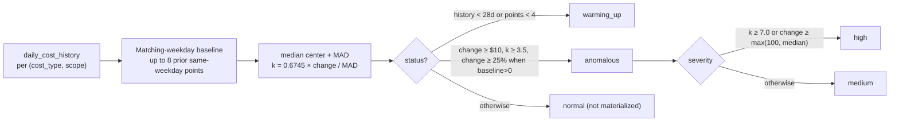

# Flux signal rules and actionability

Status: approved rule reference, 2026-08-09
Implementation version: `FLUX_INTELLIGENCE_RULE_VERSION = 2026-07-25.4` (`api/intelligence.py`)
Anomaly engine: `api/cost_anomaly.py` (`cost-seasonal-mad-v1`)
Confidence engine: `api/confidence.py` (`opportunity-confidence-v1`)

This document describes how Flux produces, scores, displays, and gates signals. A signal is evidence for review; it is not permission to delete or change an Azure resource. Destructive work requires an owner, documented pre-checks, and an approved change path.

## Two-plane placement

| Concern | Plane | Tables / modules |
|---|---|---|
| Rule evaluation (the 20+ ARG rules) | Analytical (`api/intelligence.py` → `rule_opportunity_snapshots`) | Writer produces findings; web reads snapshots |
| Opportunity confidence & valuation | Analytical (`api/confidence.py`, `api/valuation.py` → `opportunity_confidence_snapshots`, `opportunity_valuation_snapshots_v2`) | Re-scored on startup; also snapshot-published |
| Cost anomaly findings | Analytical (`api/cost_anomaly.py` → `cost_anomaly_snapshots`, `cost_anomaly_runs`) | Method/persistence metadata joined at read time |
| Actionability & `executionStatus` | Application logic over analytical snapshots + operational state (approvals, exclusions) | `actionability` retained for filter compat; `executionStatus` gates execution |

Web instances never evaluate rules — they read the last approved analytical snapshot. This is why stale evidence is both a scoring input and an `evidence_needed` gate (see below).

## How a signal is created

During the Flux intelligence synchronization, Azure Resource Graph queries and governed source datasets are evaluated against versioned rules. A matching resource becomes a finding identified by `ruleId:resourceId`. The finding carries the source observation time, resource identity, rule category, impact, confidence, explanation, and raw evidence. Duplicate findings are normalized by finding ID.

The current Flux rule source is `api/intelligence.py`. The Opportunities layer then combines Flux findings with Azure Advisor, inventory rules, cost, valuation, and confidence history. It does not treat the rule label alone as sufficient for an automatic action.

## Current ARG signal catalogue

### Compute and storage

| Rule | Match criteria | Default posture |
|---|---|---|
| `stopped_allocated_vm` | A virtual machine reports `PowerState/stopped`, rather than deallocated. | High-impact review; validate workload ownership and whether deallocation is safe. |
| `deallocated_vm_residual_cost` | A VM reports `PowerState/deallocated`. Dependent disks, public IPs, and other resources may still incur cost. | Review residual resources; not a VM-delete signal. |
| `unattached_disk` | Managed disk has no `managedBy`, is `Unattached` or has no disk state, and does not match the ASR replica/seed-disk exclusions or ASR tag heuristic. | Review-only; confirm retention, backup, DR, and owner approval before deletion. |
| `aged_snapshot` | Managed-disk snapshot `properties.timeCreated` is older than `FLUX_INTELLIGENCE_SNAPSHOT_AGE_DAYS` (default 30 days). | Review-only lifecycle candidate. Use the aged-snapshot report and complete pre-checks. |
| `premium_snapshot` | Snapshot SKU contains `Premium`. | Review whether Standard snapshot storage satisfies recovery requirements. |
| `premium_disk_underutilized_review` | Attached Premium managed disk has four required disk metrics, at least 30 days of telemetry, at least 70% coverage, combined read/write IOPS p95 at or below 20, and combined read/write throughput p95 at or below 1 MiB/s. | New review-stage signal only; no automatic target SKU or savings claim. |

The Premium attached-disk signal is deliberately conservative. It requires both IOPS and throughput evidence because low IOPS alone can hide a throughput-sensitive workload, and low throughput alone can hide a small-block I/O workload. The signal does not prove that Standard storage is safe. Capacity, latency, bursting, host caching, workload criticality, backup/restore behavior, and target-region pricing must be checked.

### Storage modernization and governance

| Rule | Match criteria | Default posture |
|---|---|---|
| `storage_gpv1_modernization` | Storage account `kind` is legacy `Storage` / GPv1. | Review migration to GPv2 and validate feature, performance, and compatibility requirements. |
| `missing_allocation_tags` | Azure resource has no tags, or the configured required-tag policy finds a missing tag. | Governance review; not a direct cost-remediation action. |

### Snapshot and network relationships

| Rule | Match criteria | Default posture |
|---|---|---|
| `snapshot_source_deleted` | Snapshot points to a source managed disk that is no longer present in Resource Graph. | Review recovery purpose and retention before deletion. |
| `public_ip_unattached` | Public IP has no IP configuration attachment. | Review reservation and future-use requirements. |
| `public_ip_orphan_nic` | Public IP is attached to a NIC with no VM and no private endpoint. | Review network ownership and dependency before release. |
| `public_ip_deallocated_vm` | Public IP is associated with a deallocated VM. | Review whether the address must remain reserved. |
| `empty_standard_load_balancer` | Standard Load Balancer has no backend targets. Basic Load Balancers are handled by the retirement rule. | Review frontends, probes, NAT, outbound, and migration implications. |
| `empty_application_gateway` | Application Gateway has no backend targets. | Review listeners, rules, probes, and reserved future use. |
| `vnet_gateway_no_connections` | Virtual network gateway has no connections and no point-to-site configuration. | Review connectivity ownership and planned use. |
| `unused_network_interface` | NIC has neither a VM association nor a private endpoint association. | Review dependency and release safety. |
| `idle_nat_gateway` | NAT Gateway has zero attached subnets. | Review network design and future reservation. |
| `empty_availability_set` | Availability Set has zero associated VMs. | Review whether it is an intentional deployment placeholder. |
| `orphaned_network_security_group` | NSG has zero subnet associations and zero NIC associations. | Review policy ownership before removal. |

### Application platform, licensing, and retirement

| Rule | Match criteria | Default posture |
|---|---|---|
| `empty_paid_app_service_plan` | Paid App Service Plan has no sites; Free, Shared, Dynamic, F1, D1, and Y1 tiers are excluded. | Review before deleting or downsizing. |
| `windows_ahb_eligibility_review` | Windows VM/VMSS image is not an excluded Microsoft Windows Desktop/Visual Studio publisher and the license type does not already start with Windows. | Eligibility review only; Flux cannot prove entitlement. |
| `sql_vm_ahb_eligibility_review` | SQL virtual machine is not AHUB licensed and SQL image SKU is not Developer or Express. | Eligibility review only; validate licensing and entitlement. |
| `basic_public_ip_retired` | Public IP uses Basic SKU. | Retirement/migration review; validate dependency and Microsoft retirement state. |
| `basic_load_balancer_retired` | Load Balancer uses Basic SKU. | Retirement/migration review; validate frontends, backend pools, probes, NAT, and outbound behavior. |

## Premium disk review signal

The attached Premium disk signal is derived from the governed telemetry summaries rather than from SKU alone. It currently accepts Azure Monitor or LogicMonitor summaries when all four metrics are present:

- Disk Read Operations/Sec
- Disk Write Operations/Sec
- Disk Read Bytes/Sec
- Disk Write Bytes/Sec

The defaults are controlled by these settings:

```text
FLUX_PREMIUM_DISK_REVIEW_WINDOW_DAYS=30
FLUX_PREMIUM_DISK_REVIEW_COVERAGE_PERCENT=70
FLUX_PREMIUM_DISK_REVIEW_IOPS_P95=20
FLUX_PREMIUM_DISK_REVIEW_THROUGHPUT_P95_BYTES=1048576
```

This is a review-stage signal. It intentionally has no recommended SKU, no estimated savings, and no automatic remediation allowlist. It can become actionable only after Flux has:

1. Confirmed stable coverage over the review window.
2. Validated that the disk is attached to the expected workload.
3. Compared capacity, latency, IOPS, throughput, caching, bursting, and recovery requirements.
4. Obtained a current Azure Retail Prices comparison for the specific region and redundancy profile.
5. Obtained owner approval or an approved change record.

If Azure Monitor/AMA does not provide the four metrics for a meaningful population, the next step is to expand the AMA collection configuration and validate ingestion. Do not lower thresholds merely to manufacture candidates.

## Scoring (confidence) — how a signal gets a priority label

`api/confidence.py` `confidence_score()` is called for every opportunity finding:

| Factor | Standard weight | Utilization-dependent weight (`compute_shutdown`) | Input |
|---|---|---|---|
| `persistence` | 0.35 | 0.25 | `min(1, 0.2 × consecutive_count)` |
| `corroboration` | 0.25 | 0.20 | `1.0` if `source_count > 1` else `0.5` |
| `sourceEvidence` | 0.25 | 0.20 | `clamp(source_evidence, 0, 1)` |
| `freshness` | 0.15 | 0.10 | 1.0 (≤2d) → 0.7 (≤7d) → 0.4 (≤30d) → 0.2 (>30d) |
| `telemetry` | — | 0.25 | `covered=1.0 / no_data=0.25 / error=0.0` |

`score = sum(factor × weight)`, rounded to 4 decimals. Label: High ≥0.75, Medium ≥0.5, Review otherwise.
Method version `opportunity-confidence-v1` is persisted per finding so every score is re-derivable; `telemetryApplicable` is true only for `compute_shutdown` family findings whose evidence carries a `telemetryStatus`.

## Cost anomaly scoring — how a cost spike becomes a finding

`api/cost_anomaly.py` (`cost-seasonal-mad-v1`):



Thresholds (from `api/config.py`):

| Setting | Default | Meaning |
|---|---|---|
| `FLUX_COST_ANOMALY_LATENCY_DAYS` | `2` | Billed-data blackout before evaluation |
| `FLUX_COST_ANOMALY_MINIMUM_HISTORY_DAYS` | `28` | Required history before scoring |
| `FLUX_COST_ANOMALY_MINIMUM_BASELINE_POINTS` | `4` | Required same-weekday points |
| `FLUX_COST_ANOMALY_BASELINE_WEEKS` | `8` | Lookback window |
| `FLUX_COST_ANOMALY_THRESHOLD_K` | `3.5` | Modified z-score gate |
| `FLUX_COST_ANOMALY_MINIMUM_INCREASE` | `10.0` | Absolute dollar floor |

Ask Flux exposes these via `get_cost_anomalies` with `baselineMedian`, `mad`, `kScore`, `percentChange`, and `methodVersion` so any finding can be independently reproduced.

### Cost anomaly windowDays (history-aware)

`GET /api/cost/anomalies` and `GET /api/cost/anomalies/export` accept `windowDays` (`7` default; options `7`/`14`/`30`/`90`/`0`). When scoped, the query filters full `cost_anomaly_snapshots` by `evaluated_at` rather than the latest-only `cost_anomalies_current` so a quiet latest day does not hide a recent active anomaly. `GET /api/inventory/changes` has the parallel `windowDays`-aware fix (commit `c1a9c3f`): when `windowDays>0` it reads full `inventory_changes` history filtered by `computed_at`.

## Stale evidence and actionability

The configured intelligence freshness window defaults to 30 days (`FLUX_INTELLIGENCE_SNAPSHOT_AGE_DAYS`). Signals older than that remain visible for audit and investigation, but they are now forced to `evidence_needed` in the Opportunities actionability layer. The reason shown is that the source evidence must be refreshed before action.

This is separate from a snapshot resource being older than 30 days. An aged snapshot is a lifecycle finding based on its Azure `timeCreated`; stale evidence is a data-freshness safeguard based on when Flux last observed the finding. The current per-rule starting windows are 1 day for VM power state and deallocated-IP findings, 2 days for attachment/topology findings, 7 days for Premium snapshot/licensing/retirement findings, and 30 days for lifecycle/utilization review. These are policy defaults, not Azure service guarantees.

Freshness also affects confidence. Current confidence scoring gives the lowest freshness contribution (0.2) to evidence older than 30 days, and telemetry evidence ages against `telemetry_metric_summaries` retention (45 days). A source's last-good snapshot can remain available during a source outage, but it must not be treated as current authorization to act.

## Aged snapshot report

The review report is available at:

```text
GET /api/signals/aged-snapshots?ageDays=30
```

It returns snapshot resource ID, name, subscription, resource group, region, creation time, SKU, observation time, and required pre-checks. The response is explicitly marked `reviewOnly: true`.

Before deleting a listed snapshot, check:

1. Approved backup and recovery retention.
2. Legal, regulatory, or audit retention.
3. Active restore, DR, ASR, migration, or rollback dependency.
4. Snapshot source and ownership.
5. Owner approval and a deletion record.

The report is intended to tell the operator what to pre-check; it does not perform deletion.

## How Opportunities become actionable

Unless a governance or portfolio rule applies, an opportunity may be marked `actionable_now` when it has corroborating independent sources, governed positive value, source-supplied positive savings, or current cost exposure with high impact or sufficient confidence. Otherwise it is `evidence_needed`.

The stale-evidence gate takes precedence over those value/corroboration shortcuts. A stale finding must be refreshed before it becomes actionable.

The API now also exposes `recommendationStatus`, `executionStatus`, and `executionBlockers`. `actionability` remains for compatibility with existing filters, but a `candidate` is not execution-ready. Execution requires owner approval, pre-checks, final resource revalidation, and the existing lifecycle/change controls. Only an explicitly implemented item maps to `executed`; no score or savings estimate can produce `execution_ready`.

## Operational notes

- **Build:** `2.0.0` + `ca66a85` (`version.json` stamped in `azure-pipelines.yml` → `settings.build_commit` → `GET /api/health` `commit`).
- **Pipeline safety-net** (`72bfcdd`): `azure-pipelines.yml` reapplies `FLUX_HOST=0.0.0.0`, `FLUX_PORT=8000`, `WEBSITE_SKIP_RUNNING_KUDUAGENT=false`, `FLUX_AUTH_MODE=entra` on every deploy — prevents the 2026-08-08 `GET /config/appsettings` wipe-class stall where every WebJob went silent.
- **Ports & snapshot mode:** dev `8765` / Rill `8786` / prod `8000`; web uses `FLUX_ANALYTICS_SNAPSHOT_MODE=snapshot` snapshots — findings are `evidence_needed` when older than `FLUX_INTELLIGENCE_SNAPSHOT_AGE_DAYS` (30d default).

## Virtual tags and reporting

Virtual tags are effective metadata produced by native tags, imported overrides, rules, and manual overrides. Precedence is manual, imported, rule-by-priority, then native. They are currently visible in the Inventory resource detail view and can be imported/reversed through the admin virtual-tag endpoints.

The remaining reporting gap is bulk semantic exposure: the semantic reporting layer and general Ask Flux inventory search still primarily use native inventory tags. A future reporting change should expose effective virtual tags as governed fields with provenance, rule/version, effective dates, and an explicit distinction from native Azure tags.

## Premium disk metric-scope gate

The Premium disk review rule now requires each of the four disk metrics to carry lineage declaring `metricScope=disk`. VM-level aggregate metrics are rejected because their activity cannot safely be attributed to one managed disk or LUN. The telemetry lineage should also record `metricResourceId`, `lun`, aggregation, sampling interval, timezone, and cache inclusion as those fields become available. Until disk-scoped lineage is present, the rule will produce no candidates; that is intentional evidence protection, not a missing alert.
