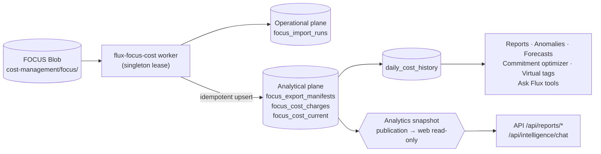

# FOCUS cost ingestion

Last reviewed: 2026-08-09
Method: FOCUS v1.0 charge-level ingestion (`api/focus.py` + `api/jobs.py` focus-cost)
Source precedence: FOCUS billed/effective/contracted/list → daily ledger → commitment optimizer hourly cube

## Purpose

Flux ingests Microsoft Cost Management FOCUS v1.0 exports as the governed
charge-level cost source. This complements the Cost Management Query API:

- FOCUS retains purchase and usage charges with resource, service, SKU, meter,
  pricing, commitment, tag, and source-lineage fields.
- `BilledCost` is promoted to daily `ActualCost`.
- `EffectiveCost` is promoted to daily `AmortizedCost`.
- `ContractedCost` and `ListCost` are retained per charge for commitment and price-sheet reconciliation.
- Query API data continues to cover subscriptions without a successful export.
- A successful FOCUS period has precedence, so a later Query API refresh cannot
  overwrite or double-count that period (manifest `runId` + period identity is the idempotency key).

Cost anomaly detection, fiscal forecasting, commitment optimization, virtual-tag
showback, and Flux Intelligence all read the same FOCUS-derived evidence — the
ingestion contract below is therefore load-bearing for every FinOps surface.

## Production source

| Setting | Value |
|---|---|
| Account | `https://prodfinopswestus3sa.blob.core.windows.net` |
| Container | `cost-management` (`FLUX_FOCUS_STORAGE_CONTAINER`) |
| Prefix | `focus/` (`FLUX_FOCUS_STORAGE_PREFIX`) |
| Authentication | FluxFinOps system-assigned managed identity (App Service → Blob) |
| Required role | Storage Blob Data Reader at the storage-account or container scope |
| Schedule | Every six hours (WebJob `flux-focus-cost`) |
| API shape | `BlobServiceClient.list_blobs` + download; `focus_error_message()` maps 401/403 → actionable role hint |

The worker only lists manifests (`*manifest.json`) and downloads previously ungoverned runs.
Microsoft Cost Management remains responsible for the daily export schedule.
`FLUX_FOCUS_LOCAL_PATH` overrides Blob discovery for local verification/backfill — same
validation and transactional semantics in both paths.

## Two-plane storage model

```
Operational plane (PostgreSQL when FLUX_OPERATIONAL_DATABASE_ENABLED=true,
                  otherwise operational DuckDB file)
  └── focus_import_runs         — one row per worker invocation (outcome, manifest_count, error)

Analytical plane (DuckDB — mutable file on writer, immutable snapshots on web)
  ├── focus_export_manifests    — export identity, period, lineage, coverage, row/byte counts,
  │                              currency (billing_currency), reconciled billed/effective totals
  ├── focus_cost_charges        — normalized analytical fields + complete source row as JSON
  │                              (future schema evolution without re-ingestion)
  ├── focus_cost_current        — current imported manifest per (subscription, billing period)
  │                              — VIEW over charges; commitment optimizer reads only here
  └── daily_cost_history        — resource/service/currency/date aggregates derived from
                                 focus_cost_current + Query API fallback; consumed by:
                                 cost-summary reports, cost-anomaly engine, fiscal forecasts,
                                 evidence packs, virtual-tag showback, Rill, and Ask Flux
```



Manifest path + `runId` + `(subscription, period)` make imports idempotent. A newer
manifest for the same subscription and period atomically supersedes the previous run;
`focus_cost_current` always reflects the winning manifest. Re-downloaded runs with the
same `runId` are no-ops in the same transaction.

### Why two planes matter here

- `focus_import_runs` is durable coordination state (attempt, retry, health) and lives
  alongside `cost_history_runs`, `throttle_state`, and `analytics_publications` on the
  operational plane so a restored analytical snapshot never replays or loses a worker outcome.
- `focus_cost_charges` is columnar evidence and stays on the analytical plane where
  DuckDB powers cost-summary, FOCUS investigation, and hourly commitment simulation queries.
- Web requests read FOCUS evidence from immutable snapshots (`FLUX_ANALYTICS_SNAPSHOT_MODE=snapshot`);
  the writer alone holds the DuckDB lease. A long report query never blocks ingestion.

## Focus → daily ledger derivation

1. Validate manifest (type `FocusCost`, has `runId`/`startDate`/`endDate`, has blobs).
2. Download charge files, parse, normalize (canonical service names, currency upper-casing,
   `BilledCost`→actual / `EffectiveCost`→amortized mapping).
3. Insert into `focus_export_manifests` + `focus_cost_charges` within one writer-lease transaction.
4. Refresh derived views/tables (`focus_cost_current`, `daily_cost_history`) — superseded
   periods are removed atomically.
5. Record outcome in `focus_import_runs` (operational plane) with manifest count and error if any.
6. Publish analytics snapshot (`analytics_publications`) so web readers see the new charges
   without opening the mutable file.

Currency is selected before aggregation (majority-currency rule) — the ingested grain
preserves per-charge currency but downstream reports never sum mixed currencies.

## Local verification and backfill

Set `FLUX_FOCUS_LOCAL_PATH` to the root containing downloaded export folders,
then run:

```powershell
python -m api.jobs focus-cost
```

Local and Azure Blob imports use the same validation and database transaction.
Source files are never committed; `in/cost-management/` is ignored.

Backfill verification:

```powershell
# Dry-run: validate without writing
python -m api.jobs focus-cost --dry-run

# Force re-import of a period already present
python -m api.jobs focus-cost --force
```

Check health:

```
GET /api/integrations/focus/status        — last import run, manifest counts, errors
GET /api/reports/focus-cost?startDate=…   — charge-level evidence with manifest lineage
GET /api/health                           — analyticsReadMode, last snapshot version
```

## Cost anomaly connection

`daily_cost_history` populated from FOCUS is the input to the seasonal anomaly engine
(`api/cost_anomaly.py`, method `cost-seasonal-mad-v1`). Gaps such as a missing
subscription day are collection gaps (not zero-usage) and are verified against the
subscription's ledger dates before scoring. An incomplete FOCUS backfill therefore
directly affects anomaly maturity and is visible as `warming_up` rather than `normal`.

## Ask Flux connection

Ask Flux tools `get_focus_cost` and `investigate_cost_change` read only
`focus_cost_current` + manifests. Every answer that cites FOCUS lists its manifest
lineage and explicit coverage (which subscriptions/periods have FOCUS vs. Query fallback).
Missing CSP contracted/list fields are returned as unavailable, never inferred as savings.

## Operational notes

- **Build:** `2.0.0` + `ca66a85` (`version.json` stamped in `azure-pipelines.yml` → `settings.build_commit` → `GET /api/health` `commit`, `GET /api/session` `build`).
- **Ports:** dev Flux `8765` (`FLUX_PORT`, `frontend/vite.config.ts` proxy, `playwright.config.ts` baseURL, `app.py`), Rill `8786` (`rill/rill.yaml`), prod `0.0.0.0:8000` (pipeline safety-net `FLUX_HOST`/`FLUX_PORT`).
- **Pipeline safety-net** (`72bfcdd`): `azure-pipelines.yml` reapplies `FLUX_HOST=0.0.0.0`, `FLUX_PORT=8000`, `WEBSITE_SKIP_RUNNING_KUDUAGENT=false`, `FLUX_AUTH_MODE=entra` on every deploy — a prior `GET`-vs-`POST /config/appsettings/list` wipe (2026-08-08) is self-healed.
- **Snapshot mode:** web reads `focus_cost_current` from immutable snapshots when `FLUX_ANALYTICS_SNAPSHOT_MODE=snapshot`; `focus_import_runs` stays operational so a snapshot restore never loses ingest outcomes.

## Current limitations

- Only subscriptions with configured FOCUS exports have charge-level coverage; others remain
  on Query API daily aggregates.
- CSP `ListCost` is not treated as a savings baseline when the provider supplies
  zero or incomplete values.
- Contracted-price reporting remains unavailable where CSP exports omit usable
  contracted/list price evidence.
- Historical charge rows are re-evaluated through current inventory + current virtual-tag
  rules — point-in-time monthly allocation journals are not yet materialized (see
  `FINOPS-AUDIT-2026-08-05.md` P2-6).
