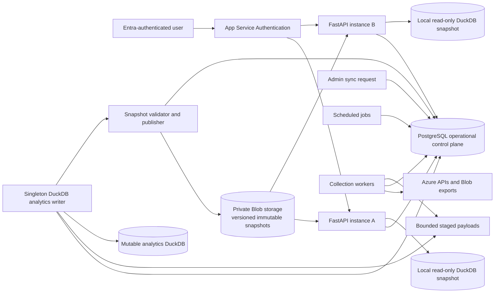

# FluxFinOps PostgreSQL + DuckDB Interim Scaling Plan

**Document type:** Implementation plan and agent execution brief  
**Audience:** Software-engineering LLM agents, including GLM 5.2 and GLM 5.4 Mini  
**System:** FluxFinOps  
**Decision status:** Proposed interim architecture  
**Primary objective:** Remove the shared DuckDB scaling constraint while retaining DuckDB as FluxFinOps' analytical engine  
**Prepared:** 2026-07-26

---

## 1. How to Use This Document

Treat this document as the complete implementation brief.

The implementing agent must:

1. Read this document completely before changing code.
2. Inspect the repository and existing migrations before assuming any exact schema, module path, or function name.
3. Preserve existing business behavior, report semantics, source lineage, authorization, and failure handling.
4. Implement the work in the phases and dependency order defined below.
5. Make reasonable repository-grounded decisions without asking follow-up questions.
6. Record assumptions in code comments, migration notes, or the final implementation summary.
7. Continue through all work that can be completed without production credentials.
8. Leave deployment-only values as documented configuration variables rather than blocking implementation.
9. Add or update automated tests for every changed behavior.
10. Update architecture, operations, deployment, and recovery documentation before declaring the work complete.

Do not ask the user to select between equivalent implementation details. Choose the option that:

- minimizes behavioral change;
- preserves existing tests and API contracts;
- keeps PostgreSQL and DuckDB responsibilities explicit;
- makes rollback simple;
- avoids introducing a second distributed analytical platform;
- moves FluxFinOps toward horizontal API scale-out.

Only stop and report a blocker when progress requires an unavailable external credential, an unavailable Azure resource, or a destructive production action. Even then, complete all code, tests, migrations, scripts, and documentation that do not require the blocked action.

---

## 2. Executive Decision

FluxFinOps will use **both PostgreSQL and DuckDB**.

The interim architecture is:

> **PostgreSQL operates FluxFinOps. DuckDB powers FluxFinOps analytics.**

PostgreSQL becomes the concurrent, transactional operational control plane. DuckDB remains the columnar analytical store, report engine, aggregation engine, and data-science execution environment.

The current shared writable DuckDB file must no longer be opened by API instances. A dedicated singleton analytics writer will own the mutable DuckDB database. It will publish immutable, versioned DuckDB snapshots to private Blob storage. Each API instance will download and open its own local snapshot in read-only mode.

This design removes the application-wide file lease from normal API traffic and allows multiple FastAPI/App Service instances to serve analytical requests concurrently.

### 2.1 Interim target

- PostgreSQL is authoritative for operational state.
- DuckDB is authoritative for analytical history and derived analytical state.
- One dedicated process writes DuckDB.
- API processes never write DuckDB.
- API processes never share an open DuckDB file with the writer.
- Every API instance reads a local immutable DuckDB snapshot.
- Blob storage distributes versioned analytical snapshots.
- PostgreSQL records publication metadata and the currently approved analytics version.
- Failed publications never replace the last-good snapshot.
- Ingestion retries are idempotent.

### 2.2 Optional later target

A future phase may move canonical analytical facts into PostgreSQL, ADLS, Azure Data Explorer, Fabric, or another distributed analytical platform and make DuckDB a fully rebuildable projection.

That future decision is outside the mandatory interim scope. Do not introduce ADX, Fabric, FinOps Hubs, or another warehouse during this implementation.

---

## 3. Source Basis

The implementation must remain consistent with the current FluxFinOps design documented in:

- `architecture.md`
- `as-built.md`
- `maturity-assessment.md`
- `fluxfinops.md`
- `FEATURE-CHECKLIST.md`
- `FOCUS-COST-INGESTION.md`
- `FLUX-INTELLIGENCE.md`
- `REPORTING-PARITY.md`
- `FINOPS-TOOLKIT-UPSTREAM.md`
- `entra-managed-identity.md`

Relevant established behaviors include:

- successful collections append observations rather than overwrite history;
- current views select the newest data from successfully completed source scopes;
- inventory, Advisor, Flux Intelligence, cost, FOCUS, Policy, and telemetry sources have independent completion and freshness state;
- partial failures preserve previously successful data;
- cost collection uses per-subscription and per-cost-type checkpoints;
- failed and incomplete cost scopes receive recovery priority;
- Azure throttle timing is durable;
- FOCUS imports are idempotent and a newer manifest supersedes the previous manifest for the same subscription and period;
- actual, amortized/effective, retail, contracted, list, and forecast values remain separate;
- missing data is exposed as unavailable and is not inferred;
- findings retain source, evidence, confidence, method version, and evidence age;
- Entra user authorization and managed-identity Azure authorization remain separate;
- Flux Intelligence uses bounded governed tools and never receives arbitrary database access;
- DuckDB currently stores both operational state and analytical data;
- all DuckDB connections currently acquire one cross-process lease;
- the single-node DuckDB file is a documented scale and maturity constraint.

If repository behavior conflicts with this document, preserve the documented business rule and report the concrete conflict in the final implementation summary.

---

## 4. Problem Statement

FluxFinOps currently uses one DuckDB database file as both:

1. the transactional application database;
2. the synchronization request queue;
3. the worker lease and checkpoint store;
4. the durable retry and throttle store;
5. the append-only analytical history;
6. the current-state reporting database;
7. the anomaly and recommendation evidence store;
8. the FOCUS charge store;
9. the Flux Intelligence transcript and usage store;
10. the API query engine.

The architecture requires all DuckDB connections, including read-only API queries, to acquire one cross-process lease because the writer and readers cannot safely use the same mutable file across the current process topology.

This creates several constraints:

- API traffic can contend with ingestion.
- A long report query can delay a writer.
- A writer can delay API reads.
- Independent WebJobs still converge on one serialized database resource.
- App Service cannot safely scale to multiple active instances against one writable file.
- Operational state and analytical state have the same failure and recovery boundary.
- Restoring one file restores unrelated workflow, transcript, configuration, and analytical data together.
- The singleton file is a documented blocker to broader Beta or production readiness.

The problem is not DuckDB's analytical performance. The problem is assigning concurrent operational coordination and shared mutable persistence to an embedded analytical database file.

---

## 5. Goals

### 5.1 Required goals

1. Remove the global DuckDB lease from API request processing.
2. Allow at least two FastAPI/App Service instances to serve requests concurrently.
3. Preserve DuckDB for analytical queries, aggregations, reporting, statistics, and data-science pipelines.
4. Move mutable operational state into PostgreSQL.
5. Preserve append-only analytical history and source lineage.
6. Preserve last-good data during source, writer, publisher, Blob, or API refresh failures.
7. Preserve exact source-scope checkpoint and retry behavior.
8. Preserve existing API contracts and frontend behavior unless an internal health field must be added.
9. Preserve Entra Reader/Admin authorization.
10. Preserve managed-identity Azure data access.
11. Keep all production database credentials out of source control.
12. Make migration and rollback deterministic.
13. Avoid dual-write inconsistency.
14. Keep the design compatible with a later distributed analytical platform.

### 5.2 Desired goals

1. Reduce DuckDB backup and restore coupling.
2. Make operational queries independent from analytical publication.
3. Allow analytical schema changes without migrating transactional workflow state.
4. Make DuckDB snapshots reproducible and verifiable.
5. Provide explicit analytics-version and source-watermark observability.
6. Make stale analytical data visible rather than silently failing.
7. Improve worker recovery after process restarts.
8. Reduce the blast radius of a corrupt DuckDB file.
9. Keep local development simple.

---

## 6. Non-Goals

Do not include the following in the interim implementation:

- Azure Data Explorer adoption;
- Microsoft Fabric adoption;
- FinOps Hubs deployment;
- Power BI publishing;
- replacement of the React application;
- replacement of FastAPI;
- replacement of App Service Authentication;
- changes to Flux.Reader or Flux.Admin semantics;
- arbitrary SQL access for Flux Intelligence;
- autonomous cloud mutation;
- redesign of cost, anomaly, forecast, valuation, confidence, or telemetry algorithms;
- changes to actual versus amortized/effective cost semantics;
- new cost allocation or chargeback policy;
- changing FOCUS source precedence;
- changing Cost Management retry policy except where required to persist it in PostgreSQL;
- converting all DuckDB analytical SQL to PostgreSQL SQL;
- making multiple processes write the same DuckDB database;
- exposing a DuckDB file over Azure Files or another shared network filesystem as the scale-out solution;
- introducing Kafka, Service Bus, or another message broker unless separately approved.

PostgreSQL itself will provide the interim durable work-claiming mechanism.

---

## 7. Target Architecture



### 7.1 Component roles

#### PostgreSQL

PostgreSQL owns:

- application and integration configuration;
- sync requests;
- source-scope work items;
- worker claims and leases;
- source attempt history;
- retry eligibility;
- Azure throttle-until state;
- source completion and freshness metadata;
- analytics apply jobs;
- analytics publication records;
- review workflows;
- Flux Intelligence transcript and usage metadata;
- mutable administrative state.

#### Mutable DuckDB

One dedicated writer owns the mutable analytical DuckDB database.

It stores:

- resource snapshots;
- cost snapshots;
- daily cost history;
- FOCUS charges;
- Advisor snapshots;
- Flux Signal observations;
- Azure Policy observations;
- telemetry observations and summaries;
- anomaly runs and findings;
- opportunity confidence and valuation;
- inventory drift history;
- current analytical views;
- governed reporting views;
- reference mappings used in analytics.

#### Blob storage

Private Blob storage stores:

- immutable versioned DuckDB snapshot files;
- publication manifests;
- optional staged large payloads;
- existing source exports and governed backups.

#### API-local DuckDB

Each API instance owns a local read-only copy of the currently approved analytical snapshot.

The local file is disposable. It must be recoverable by downloading the current approved version from Blob storage.

---

## 8. Authoritative Data Ownership

The following ownership rule is mandatory:

> A record has exactly one authoritative durable store.

Do not write the same authoritative record independently to PostgreSQL and DuckDB.

### 8.1 PostgreSQL-owned entities

Move these categories to PostgreSQL:

| Category | Examples | Reason |
|---|---|---|
| Integration configuration | `azure_integration` and source settings | Mutable configuration and concurrent admin access |
| Parent synchronization workflow | `sync_runs` | Transactional state machine |
| Child source scopes | `sync_source_runs` | Concurrent claims and retries |
| Source health and checkpoints | `source_sync_state` or equivalent | Durable mutable state |
| Cost request attempts | QPU attempts, HTTP status, retry headers | Frequent updates and recovery |
| Throttle state | throttle-until timestamps and request gates | Shared concurrent coordination |
| Cost Details fallback state | `cost_details_backfill_scopes` or equivalent | Durable asynchronous workflow |
| FOCUS worker metadata | `focus_import_runs` | Operational execution state |
| Analytics apply jobs | new | Bridges collected payloads to the DuckDB writer |
| Analytics publications | new | Approved version, checksum, status, watermark |
| Worker lease metadata | new or PostgreSQL advisory locks | Process coordination |
| Review state | anomaly review, opportunity review, administrative decisions | User mutation |
| Intelligence transcripts | retained prompts and validated replies | Mutable retention and admin review |
| Intelligence usage events | latency, tokens, cost estimate, feedback | Concurrent event ingestion |
| Feature/configuration state | runtime-governed mutable settings | Transactional application state |

### 8.2 DuckDB-owned entities

Keep these categories in DuckDB during the interim:

| Category | Examples | Reason |
|---|---|---|
| Inventory history | `resource_snapshots` | Append-only analytics |
| Current inventory projection | `resources_current` | Analytical latest-complete view |
| Cost observations | `cost_snapshots`, `daily_cost_history` | Time-series scans and aggregation |
| FOCUS analytical charges | `focus_cost_charges`, `focus_cost_current` | Charge-level analytics |
| Advisor history | `advisor_recommendation_snapshots` | Analytical evidence history |
| Flux Signal history | `rule_opportunity_snapshots` or equivalent | Versioned findings |
| Policy observations | assignment and resource state | Analytical posture reporting |
| Telemetry | raw observations and rolling summaries | Analytical/statistical processing |
| Anomalies | method-versioned runs and findings | Analytical output |
| Opportunity confidence | persisted method-versioned values | Analytical output |
| Opportunity valuation | gross and risk-adjusted values | Analytical output |
| Drift history | fingerprints and change baselines | Analytical/statistical processing |
| Toolkit reference data | pinned mappings and provenance | Read-mostly analytical joins |
| Governed report views | cost, anomaly, workload, governance, rate optimization | Fast serving |
| Ask Flux report inputs | bounded governed analytical views | Read-only tool access |

### 8.3 Split entities

Some concepts require operational metadata in PostgreSQL and analytical rows in DuckDB.

#### FOCUS

- PostgreSQL: import execution state, retry state, publication eligibility, operational manifest status.
- DuckDB: normalized charge rows, current manifest projection, daily aggregates.
- Blob: original export source files.

#### Cost Management

- PostgreSQL: attempts, retry headers, throttle state, expected/completed scopes, recovery priority.
- DuckDB: committed cost facts and analytical current views.

#### Flux Intelligence

- PostgreSQL: transcripts, usage events, feedback, retention processing.
- DuckDB: report data, governed analytical views, deterministic findings, quality aggregates if they are report-oriented.

---

## 9. Consistency Model

The interim design cannot rely on a distributed transaction between PostgreSQL and DuckDB.

Use a staged, idempotent state machine.

### 9.1 Required state sequence

For each independently recoverable source scope:

```text
queued
  -> claimed
  -> collecting
  -> payload_staged
  -> analytics_pending
  -> analytics_applying
  -> analytics_committed
  -> completed
```

Failure states:

```text
retry_wait
failed
cancelled
```

Publication is a separate state machine:

```text
requested
  -> building
  -> validating
  -> uploaded
  -> approved
```

Failure states:

```text
publish_failed
validation_failed
superseded
```

### 9.2 Scope completion rule

A source scope must not be marked `completed` and must not advance its source checkpoint until:

1. collection succeeded;
2. the collected payload was staged durably or can be deterministically recollected;
3. the singleton DuckDB writer committed the analytical rows;
4. the writer recorded an idempotency marker;
5. PostgreSQL recorded `analytics_committed`.

A publication does not need to finish before the source scope is considered analytically committed. The APIs may continue serving the previous published snapshot until a new publication passes validation.

### 9.3 Idempotency

Every analytics apply job must have a stable idempotency key derived from source identity.

Examples:

```text
inventory:<subscription_id>:<collection_id>
advisor:<subscription_id>:<collection_id>
cost-query:<subscription_id>:<cost_type>:<start_date>:<end_date>:<attempt_group>
cost-details:<subscription_id>:<cost_type>:<calendar_month>:<report_identity>
focus:<manifest_path>:<manifest_checksum>
telemetry:<provider>:<device_or_resource>:<window_start>:<window_end>
policy:<subscription_id>:<collection_id>
rule-pack:<rule_pack_version>:<subscription_id>:<collection_id>
```

DuckDB must persist applied keys or enforce equivalent unique business keys.

On retry:

- if the apply key is absent, apply the payload;
- if the apply key exists with the same checksum, treat the operation as successful;
- if the apply key exists with a different checksum, fail closed and surface a data-integrity error.

### 9.4 Do not implement naive dual writes

Forbidden pattern:

```text
worker writes DuckDB
worker writes PostgreSQL
worker assumes both succeeded
```

Required pattern:

```text
worker records/stages work in PostgreSQL
singleton writer applies it idempotently to DuckDB
writer records success in PostgreSQL
publisher later creates an immutable snapshot
```

---

## 10. PostgreSQL Schema Requirements

Inspect the repository for existing models and migrations before creating names. Preserve existing identifiers where practical.

At minimum, implement tables equivalent to the following.

### 10.1 Operational tables

#### `azure_integration`

Purpose:

- tenant and configured subscription scope;
- provider choice;
- enabled sources;
- non-secret integration configuration;
- administrative timestamps and version.

Requirements:

- preserve existing admin-only mutation behavior;
- do not store Azure credentials;
- preserve explicit subscription boundaries.

#### `sync_runs`

Suggested columns:

- `id`
- `request_type`
- `requested_by`
- `requested_at`
- `status`
- `started_at`
- `completed_at`
- `lease_owner`
- `lease_expires_at`
- `error_category`
- `error_message`
- `created_at`
- `updated_at`

#### `sync_source_runs`

Suggested columns:

- `id`
- `sync_run_id`
- `source`
- `scope_type`
- `scope_key`
- `subscription_id`
- `cost_type`
- `period_start`
- `period_end`
- `priority`
- `status`
- `attempt_count`
- `next_retry_at`
- `claimed_by`
- `claim_expires_at`
- `analytics_apply_job_id`
- `started_at`
- `completed_at`
- `error_category`
- `error_message`
- `created_at`
- `updated_at`

Required uniqueness:

```text
one active logical child scope per parent run and source/scope identity
```

#### `source_sync_state`

Suggested natural key:

```text
source + scope_type + scope_key
```

Suggested columns:

- latest attempt;
- latest successful attempt;
- latest analytically committed watermark;
- expected scope count;
- completed scope count;
- current status;
- next eligible run;
- stale/degraded indicators;
- last-good row count;
- source-specific metadata.

#### `request_attempts`

Use one normalized table or source-specific tables.

It must preserve:

- attempt timestamps;
- HTTP status;
- retry headers;
- retry eligibility;
- QPU or request cost when available;
- error category;
- bounded response metadata;
- no signed report URL storage;
- no token or secret storage.

#### `throttle_state`

Natural key examples:

```text
provider + tenant_or_billing_scope + request_class
```

Persist:

- throttle-until timestamp;
- source of throttle guidance;
- last updated;
- request-cost estimate if used;
- owner/version for safe concurrent updates.

#### `analytics_apply_jobs`

Suggested columns:

- `id`
- `source_run_id`
- `idempotency_key`
- `payload_location`
- `payload_checksum`
- `payload_format`
- `status`
- `attempt_count`
- `next_retry_at`
- `claimed_by`
- `claim_expires_at`
- `duckdb_transaction_id` or applied marker
- `row_count`
- `started_at`
- `committed_at`
- `error_category`
- `error_message`
- `created_at`
- `updated_at`

Required uniqueness:

```text
idempotency_key
```

#### `analytics_publications`

Suggested columns:

- `id`
- `version`
- `source_watermark`
- `status`
- `blob_path`
- `manifest_path`
- `file_checksum`
- `file_size_bytes`
- `duckdb_schema_version`
- `row_counts_json`
- `validation_results_json`
- `requested_at`
- `started_at`
- `uploaded_at`
- `approved_at`
- `superseded_at`
- `error_category`
- `error_message`

Required uniqueness:

```text
version
blob_path
file_checksum
```

Maintain one explicitly approved publication pointer. Do not infer “current” only from timestamps.

### 10.2 Concurrency indexes

Add indexes for:

- queued work ordered by priority and creation time;
- retry-eligible work ordered by `next_retry_at`;
- expired claims;
- source and scope identity;
- latest successful source state;
- current approved analytics publication;
- transcript and usage retention expiration;
- review status;
- admin health queries.

Do not add indexes speculatively to large analytical data that remains in DuckDB.

### 10.3 Work claiming

Preferred PostgreSQL pattern:

```sql
WITH candidate AS (
    SELECT id
    FROM sync_source_runs
    WHERE status IN ('queued', 'retry_wait')
      AND (next_retry_at IS NULL OR next_retry_at <= now())
      AND (claim_expires_at IS NULL OR claim_expires_at <= now())
    ORDER BY priority ASC, created_at ASC
    FOR UPDATE SKIP LOCKED
    LIMIT 1
)
UPDATE sync_source_runs AS s
SET status = 'claimed',
    claimed_by = :worker_id,
    claim_expires_at = now() + :lease_interval,
    updated_at = now()
FROM candidate
WHERE s.id = candidate.id
RETURNING s.*;
```

Use the repository's SQL toolkit and transaction conventions. Do not concatenate SQL.

### 10.4 Lease behavior

- Claims must expire.
- A replacement worker must recover expired claims.
- Heartbeats may extend active claims.
- A worker must not complete work after losing ownership without revalidating the claim.
- Singleton DuckDB writer ownership may use a PostgreSQL advisory lock or a renewable lease row.
- Publication ownership must be separate from source collection ownership.
- Cost throttling state must be shared through PostgreSQL, not a local file.

---

## 11. DuckDB Writer Requirements

### 11.1 Single ownership

Exactly one active production process may mutate the analytics DuckDB database.

This process may be:

- a dedicated continuous WebJob;
- a dedicated worker mode in the existing job package;
- a separately deployed worker process.

Do not let FastAPI request handlers open the mutable file.

### 11.2 Writer responsibilities

The writer must:

1. claim one `analytics_apply_job`;
2. validate the staged payload;
3. check the idempotency key;
4. begin a DuckDB transaction;
5. insert, replace, or reconcile rows using the existing source-specific semantics;
6. update analytical current views or tables as currently designed;
7. record the applied idempotency marker;
8. commit;
9. record row counts and success in PostgreSQL;
10. mark the related source scope analytically committed;
11. make the next apply job eligible.

### 11.3 Preserve source semantics

The writer must preserve:

- append-only resource observations;
- latest-complete current views;
- source scope independence;
- previous-good data on partial failure;
- FOCUS period precedence over Query API data;
- actual versus amortized/effective separation;
- currency boundaries;
- method versions;
- evidence age;
- semantic Advisor de-duplication;
- defensive Opportunities de-duplication;
- no-data, warming-up, partial, conflicting, and actionable states;
- missing telemetry is never equivalent to idle;
- missing price data is never inferred;
- signed Cost Details URLs are never persisted or logged.

### 11.4 Payload staging

Use the simplest safe staging option supported by payload size.

Preferred order:

1. small bounded payload serialized into PostgreSQL JSONB only when size is predictably small;
2. temporary private Blob object referenced by `payload_location`;
3. deterministic recollection only when the upstream API and idempotency semantics make recollection safe.

For large inventory, cost, telemetry, and FOCUS payloads, prefer private Blob staging.

Staged objects must:

- be encrypted by the platform;
- use managed identity or a Key Vault-backed access path;
- have bounded retention;
- never expose signed URLs in logs;
- include a checksum;
- be deleted after retention and recovery requirements are satisfied.

### 11.5 Mutable DuckDB location

The mutable writer database may remain on persistent App Service storage during the first implementation phase if only the writer opens it.

However:

- it must not be opened by API instances;
- it must not be copied while an uncheckpointed write is active;
- publication must use a safe checkpoint/copy procedure;
- backup and snapshot operations must be writer-controlled.

---

## 12. Snapshot Publication Design

### 12.1 Publication trigger

Trigger a publication when one or more of these occurs:

- a meaningful source scope commits;
- a scheduled publication interval elapses;
- an administrator requests publication;
- application deployment requires a verified starting snapshot.

Coalesce bursts. Do not publish a full snapshot for every individual row or tiny child scope.

Recommended initial behavior:

- publish after a synchronization request finishes;
- publish after the cost-history job finishes;
- publish after a FOCUS import batch finishes;
- publish after a telemetry batch finishes;
- publish at least once on a bounded periodic schedule when unpublished changes exist.

### 12.2 Build process

The publisher must:

1. acquire singleton publication ownership;
2. checkpoint the mutable DuckDB database;
3. create a versioned candidate copy;
4. open the candidate independently in read-only mode;
5. run integrity and schema checks;
6. run required report smoke queries;
7. record row counts for critical tables and views;
8. calculate a cryptographic checksum;
9. upload the candidate to private Blob storage;
10. upload a manifest;
11. atomically mark the publication approved in PostgreSQL;
12. retain the previous approved version for rollback;
13. prune old versions according to the retention policy.

### 12.3 Publication manifest

Example:

```json
{
  "version": 1842,
  "status": "approved",
  "generated_at": "2026-07-26T23:30:00Z",
  "source_watermark": 1842,
  "duckdb_schema_version": "2026.07.26.1",
  "database_blob": "analytics/snapshots/flux-analytics-1842.duckdb",
  "checksum_sha256": "<sha256>",
  "file_size_bytes": 0,
  "critical_row_counts": {
    "resources_current": 0,
    "daily_cost_history": 0,
    "focus_cost_current": 0,
    "opportunities_current": 0
  },
  "validation": {
    "integrity": "passed",
    "schema": "passed",
    "report_smoke": "passed",
    "currency_checks": "passed"
  }
}
```

Do not expose sensitive raw source content in the manifest.

### 12.4 Validation gates

A candidate cannot be approved unless:

- DuckDB opens successfully in read-only mode;
- required tables and views exist;
- schema version is supported by the running API;
- critical current views execute;
- row counts are non-negative and internally coherent;
- no currency-unsafe aggregate is detected by existing tests;
- source precedence checks pass;
- a bounded set of API repository smoke queries passes;
- the checksum is recorded;
- publication metadata is committed.

### 12.5 Last-good behavior

If publication fails:

- keep serving the previous approved snapshot;
- expose publication degradation in operational health;
- retain the failed publication record;
- make retry eligible;
- do not advance the approved pointer;
- do not delete the previous snapshot.

---

## 13. API Snapshot Consumer Design

### 13.1 Startup behavior

On startup, each API instance must:

1. read the current approved publication metadata from PostgreSQL;
2. check whether the matching local file exists;
3. verify its checksum when first downloaded or when corruption is suspected;
4. download it from private Blob storage if needed;
5. open it read-only;
6. run a minimal repository smoke query;
7. mark the local analytics version ready.

The API may start in degraded operational-only mode if PostgreSQL is available but no analytical snapshot can be loaded. Existing product requirements may instead prefer startup failure. Choose the behavior that best preserves the current health contract, document it, and test it.

Recommended behavior:

- health endpoint is alive;
- readiness is false until a valid analytical snapshot is loaded;
- Entra authentication remains active;
- analytical endpoints return a structured service-unavailable response rather than incorrect empty data.

### 13.2 Refresh behavior

Each API instance should poll or opportunistically check PostgreSQL for a newer approved version.

When a new version exists:

1. download to a temporary local filename;
2. verify checksum;
3. open and smoke-test read-only;
4. create a new connection pool or repository handle;
5. atomically swap new requests to the new handle;
6. allow in-flight requests to complete against the old handle;
7. close the old handle;
8. delete the old local file after a safe delay or retention count.

Never replace an open file in place.

### 13.3 Local file location

Use instance-local storage, not the shared App Service `/home` path, for the API copy when possible.

Requirements:

- each instance owns its copy;
- copies are disposable;
- no API process writes to the file;
- restart recovery downloads from Blob;
- local pruning keeps bounded disk usage.

### 13.4 Repository routing

Introduce explicit repository boundaries.

Example interfaces:

```python
class OperationalStore:
    ...

class AnalyticsStore:
    ...

class AnalyticsSnapshotManager:
    ...
```

Use PostgreSQL for:

- integration administration;
- sync creation;
- worker/source health;
- retries;
- review actions;
- transcript review;
- usage events;
- publication health.

Use local DuckDB for:

- Overview;
- Inventory search and facets;
- resource analytical detail;
- Opportunities;
- Cost Summary;
- Cost Anomalies;
- workload optimization;
- governance posture;
- commitment/rate analysis;
- deterministic evidence packs;
- governed Ask Flux report tools.

A request may combine both stores. Keep the join in application services using stable identifiers. Do not create hidden cross-database write coupling.

---

## 14. Configuration

Add environment settings equivalent to:

```text
FLUX_OPERATIONAL_DATABASE_URL=<secure runtime reference>
FLUX_OPERATIONAL_DATABASE_AUTH_MODE=<approved mode>

FLUX_ANALYTICS_WRITER_PATH=<mutable writer-only DuckDB path>
FLUX_ANALYTICS_LOCAL_DIR=<instance-local snapshot directory>

FLUX_ANALYTICS_BLOB_ACCOUNT_URL=<private storage account URL>
FLUX_ANALYTICS_BLOB_CONTAINER=<private container>
FLUX_ANALYTICS_BLOB_PREFIX=analytics/snapshots

FLUX_ANALYTICS_REFRESH_SECONDS=60
FLUX_ANALYTICS_LOCAL_RETAIN_COUNT=2
FLUX_ANALYTICS_BLOB_RETAIN_COUNT=<approved count>
FLUX_ANALYTICS_PUBLISH_MIN_INTERVAL_SECONDS=<bounded interval>
FLUX_ANALYTICS_CLAIM_SECONDS=<bounded lease>
FLUX_ANALYTICS_PUBLISH_ON_SYNC_COMPLETE=true
```

Exact names may follow repository conventions.

Security requirements:

- no connection string or password in source control;
- prefer an approved passwordless Entra/managed-identity path when supported by the deployed PostgreSQL configuration and Python driver;
- otherwise use a Key Vault-backed secret reference with rotation;
- Blob access must use managed identity;
- database permissions must use least privilege;
- API, worker, and migration identities should be separated when practical;
- API instances require read/write operational permissions only for their actual features, not superuser rights;
- schema migrations require a controlled deployment identity;
- the DuckDB snapshot container must not be public.

---

## 15. Migration Phases

Do not implement all changes as one unreviewable rewrite.

### Phase 0 — Discovery and baseline

#### Tasks

1. Inventory every DuckDB table, view, sequence, macro, and migration.
2. Find every function that opens a DuckDB connection.
3. Classify each use as:
   - operational read;
   - operational write;
   - analytical read;
   - analytical write;
   - schema migration;
   - backup;
   - test fixture.
4. Find all cross-process lease code and call sites.
5. Find all scheduled and continuous worker entry points.
6. Find all source checkpoint and retry state transitions.
7. Find all transcript, usage, feedback, and review writes.
8. Capture baseline tests and representative row counts.
9. Document current startup, health, backup, and restore flows.
10. Produce a table-to-owner migration inventory.

#### Deliverable

Create or update a repository document such as:

```text
docs/postgres-duckdb-migration-inventory.md
```

#### Exit criteria

- every database object has a target owner;
- every database access path is identified;
- current tests pass before migration work starts;
- no table is silently omitted.

---

### Phase 1 — Introduce storage abstractions

#### Tasks

1. Add an `OperationalStore` interface.
2. Add an `AnalyticsStore` interface.
3. Add an `AnalyticsSnapshotManager` interface.
4. Refactor application services to depend on interfaces rather than direct global DuckDB helpers.
5. Keep DuckDB-backed adapters temporarily so behavior remains unchanged.
6. Add unit tests proving service behavior through the interfaces.
7. Do not change API contracts.

#### Exit criteria

- operational and analytical calls are separable in code;
- direct DuckDB opens are limited to adapters, migrations, tests, and writer code;
- existing behavior remains green.

---

### Phase 2 — Provision PostgreSQL support

#### Tasks

1. Add the PostgreSQL driver and pooling library compatible with the project.
2. Add migration tooling or extend existing migrations.
3. Implement connection health, bounded timeout, retry, and transaction helpers.
4. Add PostgreSQL schema migrations for operational tables.
5. Add local development configuration, preferably with a containerized PostgreSQL option.
6. Add CI support for PostgreSQL-backed tests.
7. Add startup validation that does not log credentials.
8. Document Azure provisioning requirements without embedding environment-specific secrets.

#### Exit criteria

- migrations can create a clean operational database;
- CI can run operational-store tests;
- connection failures are categorized and bounded;
- credentials do not appear in logs.

---

### Phase 3 — Migrate operational state

Migrate in this order:

1. integration configuration;
2. sync parent requests;
3. source child scopes;
4. source state and checkpoints;
5. attempt and retry records;
6. throttle state;
7. Cost Details fallback state;
8. FOCUS execution metadata;
9. review workflows;
10. Flux Intelligence transcripts, usage, feedback, and retention state.

#### Migration method

1. stop or drain writers during the one-time migration;
2. export operational rows from DuckDB;
3. import into PostgreSQL;
4. preserve stable identifiers where externally referenced;
5. validate counts and key fields;
6. validate timestamps in UTC;
7. validate active and retry-eligible state;
8. make PostgreSQL the write target;
9. temporarily retain old DuckDB tables for rollback;
10. prevent new operational writes to DuckDB.

#### Exit criteria

- all operational mutations use PostgreSQL;
- health and admin pages read operational state from PostgreSQL;
- expired worker recovery works;
- retry ordering remains correct;
- transcript retention works;
- old DuckDB operational tables are no longer authoritative.

---

### Phase 4 — Replace file-backed coordination

#### Tasks

1. Replace the global worker lease with PostgreSQL claims or advisory locks.
2. Replace file-backed cost request gating with PostgreSQL throttle state.
3. Implement `FOR UPDATE SKIP LOCKED` work claiming.
4. Implement claim expiry and worker recovery.
5. Preserve failed-first and missing-first priority rules.
6. Add concurrency tests with two or more workers.
7. Add crash-recovery tests.
8. Ensure an ad-hoc metadata sync does not create a competing cost sweep.
9. Preserve bounded Cost Details fallback behavior.

#### Exit criteria

- multiple collection processes can coordinate without a shared file lock;
- only one logical scope is processed by one worker at a time;
- expired claims recover;
- throttle timing survives restarts;
- no API request participates in worker coordination locks.

---

### Phase 5 — Introduce analytics apply jobs

#### Tasks

1. Add durable staged payload handling.
2. Add `analytics_apply_jobs`.
3. Add stable idempotency keys and payload checksums.
4. Change collectors to stage analytical payloads rather than writing DuckDB directly.
5. Implement the singleton analytics writer.
6. Move existing analytical write logic behind the writer adapter.
7. Preserve source-specific transactions and reconciliation.
8. Record apply row counts and errors in PostgreSQL.
9. Advance source checkpoints only after DuckDB commit.
10. Add retry and duplicate-delivery tests.

#### Exit criteria

- collection workers do not directly mutate DuckDB;
- one writer performs all analytical mutations;
- duplicate jobs do not duplicate facts;
- checksum conflict fails closed;
- source completion follows analytical commit.

---

### Phase 6 — Publish immutable DuckDB snapshots

#### Tasks

1. Add publication scheduling and coalescing.
2. Add safe DuckDB checkpoint and copy.
3. Add candidate validation.
4. Add checksum generation.
5. Upload versioned files and manifests to private Blob storage.
6. Add `analytics_publications`.
7. Approve publication atomically in PostgreSQL.
8. Retain previous approved snapshots.
9. Add pruning.
10. Add publication health and metrics.

#### Exit criteria

- every approved snapshot is immutable and checksummed;
- failed snapshots never become current;
- previous snapshots remain downloadable;
- publication is observable;
- a clean API instance can obtain the approved version.

---

### Phase 7 — Convert API reads to local read-only snapshots

#### Tasks

1. Implement `AnalyticsSnapshotManager`.
2. Download the approved snapshot on startup.
3. Verify checksum.
4. Open read-only.
5. Route analytical repositories to the local snapshot.
6. Poll for newer approved versions.
7. Atomically swap repository handles.
8. protect in-flight requests;
9. prune old local files;
10. remove API acquisition of the global DuckDB writer lease.

#### Exit criteria

- API instances never open the mutable writer database;
- two API instances can serve analytics concurrently;
- API refresh does not interrupt in-flight requests;
- a failed refresh keeps the old version;
- stale version is visible in health metadata.

---

### Phase 8 — Scale-out and cutover validation

#### Tasks

1. Run at least two API instances.
2. Run concurrent dashboard, inventory, opportunity, and cost requests.
3. Run ingestion and publication concurrently with API load.
4. Restart one API instance during publication.
5. restart the analytics writer during an apply job;
6. simulate Blob download failure;
7. simulate PostgreSQL transient failure;
8. simulate invalid snapshot checksum;
9. simulate failed source scope;
10. verify last-good analytical data remains available.
11. Compare governed report outputs against the pre-migration DuckDB baseline.
12. Run authenticated Reader and Admin smoke tests.
13. Verify Reader cannot mutate integrations.
14. Verify no secrets or signed URLs appear in logs.

#### Exit criteria

All acceptance criteria in Section 18 pass.

---

### Phase 9 — Cleanup and documentation

#### Tasks

1. Remove obsolete API DuckDB lease paths.
2. Remove file-backed operational locks and throttle files.
3. Mark old operational DuckDB tables deprecated or remove them after rollback expiry.
4. Update backup and restore procedures.
5. Update deployment pipeline.
6. Update as-built documentation.
7. Update architecture diagrams.
8. Update maturity assessment.
9. Update operational alerts and runbooks.
10. Record the rollback-expiry date and remove compatibility code afterward.

---

## 16. Data Migration and Backfill Rules

### 16.1 General rules

- Preserve UTC timestamps.
- Preserve stable IDs where application links or foreign keys depend on them.
- Preserve source lineage.
- Preserve raw JSON where currently retained.
- Preserve method versions.
- Preserve exact currency.
- Do not convert missing values to zero.
- Do not infer contracted or list price.
- Do not collapse actual and amortized/effective cost.
- Do not discard failed attempts if they are part of operational history.
- Do not advance source state during export/import until validation succeeds.

### 16.2 Validation

For each migrated PostgreSQL table, compare:

- total row count;
- active row count;
- rows by status;
- minimum and maximum timestamps;
- retry-eligible count;
- latest successful scope by source;
- nullability distribution for critical fields;
- deterministic checksum of stable business columns.

For retained DuckDB analytics, compare:

- current resource count;
- history range;
- actual cost totals by currency and period;
- amortized/effective cost totals by currency and period;
- FOCUS current manifests;
- opportunity counts by source and kind;
- telemetry coverage states;
- anomaly warm-up and mature scope counts;
- Policy posture totals;
- critical report outputs.

---

## 17. Failure and Recovery Behavior

### 17.1 PostgreSQL unavailable

- Do not process new operational mutations.
- Do not claim new work.
- Existing API analytical reads may continue from the local DuckDB snapshot when authorization/session behavior permits.
- Health must report operational degradation.
- Do not silently accept admin sync requests that cannot be persisted.

### 17.2 DuckDB writer unavailable

- Collection work may pause before payload staging limits are exceeded.
- Existing published snapshots remain queryable.
- Apply jobs remain retryable.
- Source checkpoints do not advance.
- Health reports writer degradation.

### 17.3 Publication fails

- Keep the previous approved version.
- Keep API instances on their current local version.
- Retain the failed publication record.
- Retry according to bounded policy.
- Do not mark source analytical commits as failed merely because publication failed.

### 17.4 Blob unavailable

- API instances with a valid local snapshot continue serving it.
- New instances remain unready if they cannot download any valid snapshot.
- Publisher retains the candidate or can rebuild it.
- Approved pointer must not reference a file that was not successfully uploaded and verified.

### 17.5 API local snapshot corrupt

- Remove the local corrupt copy.
- Download the current approved version.
- Verify checksum.
- If current version still fails, attempt the previous approved version and report degradation.
- Never return silently empty analytical results.

### 17.6 Writer crashes after DuckDB commit but before PostgreSQL update

- Retry the apply job.
- Detect the existing idempotency key and checksum.
- Treat it as committed.
- Repair PostgreSQL state.
- Do not duplicate analytical rows.

### 17.7 PostgreSQL update succeeds but DuckDB commit fails

This ordering is forbidden. PostgreSQL must not mark analytical commit before DuckDB commit.

---

## 18. Acceptance Criteria

The implementation is complete only when all applicable criteria pass.

### 18.1 Architecture

- [ ] PostgreSQL is the authoritative operational store.
- [ ] DuckDB remains the analytical store.
- [ ] Exactly one process writes the mutable DuckDB database.
- [ ] API instances use local read-only snapshots.
- [ ] API instances do not acquire the global DuckDB writer lease.
- [ ] Approved snapshots are versioned and immutable.
- [ ] Blob storage is private.
- [ ] A future distributed analytical store can replace the DuckDB writer without redesigning operational workflow.

### 18.2 Concurrency

- [ ] At least two API instances serve analytical traffic concurrently.
- [ ] At least two collection workers can claim different scopes concurrently.
- [ ] The same logical scope is not processed concurrently.
- [ ] Expired claims recover.
- [ ] Writer and API traffic do not contend on one file.
- [ ] Publication does not require stopping all API traffic.

### 18.3 Correctness

- [ ] Append-only history is preserved.
- [ ] Current views use successful source scopes.
- [ ] Partial failures preserve previous-good data.
- [ ] FOCUS precedence remains correct.
- [ ] Actual and amortized/effective costs remain separate.
- [ ] Currency is explicit.
- [ ] Missing data is not inferred.
- [ ] Advisor and opportunity de-duplication remains correct.
- [ ] Telemetry coverage states remain correct.
- [ ] Method versions and evidence age remain visible.
- [ ] Retry and throttle behavior remains durable.

### 18.4 Reliability

- [ ] Writer crash after commit is idempotently recoverable.
- [ ] Failed publication preserves the previous approved version.
- [ ] API refresh failure preserves the existing local version.
- [ ] New API instances can recover from Blob.
- [ ] Corrupt local files are detected.
- [ ] Corrupt published files are not approved.
- [ ] PostgreSQL and Blob outages produce explicit degraded health.
- [ ] Rollback to a prior approved snapshot is documented and tested.

### 18.5 Security

- [ ] Entra authentication behavior is unchanged.
- [ ] Reader/Admin API enforcement is unchanged.
- [ ] Managed identity remains read-only against Azure source APIs.
- [ ] PostgreSQL credentials are not committed.
- [ ] Blob container is private.
- [ ] Signed Cost Details URLs are not persisted or logged.
- [ ] Flux Intelligence still has no arbitrary database or SQL access.
- [ ] Raw internal infrastructure JSON remains protected.
- [ ] Migration logs contain no secrets.

### 18.6 Testing

- [ ] Existing backend tests pass.
- [ ] Existing frontend tests pass.
- [ ] Authenticated Reader/Admin smoke tests pass.
- [ ] PostgreSQL migration tests pass.
- [ ] Work-claim concurrency tests pass.
- [ ] Apply-job idempotency tests pass.
- [ ] Snapshot validation tests pass.
- [ ] Snapshot swap tests pass.
- [ ] Report parity tests pass.
- [ ] Failure-injection tests pass.

### 18.7 Operations

- [ ] Health reports PostgreSQL, writer, publication, approved snapshot, and local snapshot status.
- [ ] Health reports current and last-good analytical version.
- [ ] Health reports snapshot age.
- [ ] Health reports unapplied job count.
- [ ] Health reports failed publication count.
- [ ] Runbooks cover backup, restore, rollback, and disaster recovery.
- [ ] Deployment order is documented.
- [ ] Retention and pruning are configured.
- [ ] Operational alerts are defined.

---

## 19. Observability

Add structured metrics or health fields for:

### PostgreSQL

- connection success/failure;
- pool utilization;
- transaction failures;
- queued source runs;
- retry-eligible scopes;
- expired claims;
- claim latency;
- throttle-until state.

### Analytics writer

- pending apply jobs;
- oldest pending job age;
- apply duration;
- rows applied;
- duplicate/idempotent replays;
- checksum conflicts;
- last successful commit;
- writer lease owner and expiry.

### Publications

- current approved version;
- source watermark;
- snapshot age;
- build duration;
- validation duration;
- upload duration;
- file size;
- checksum status;
- failed publication count;
- last failure category.

### API instances

- loaded analytics version;
- local snapshot age;
- refresh duration;
- refresh failure count;
- current in-flight query count during swaps;
- DuckDB query average and p95;
- repository errors by report contract.

Do not expose secrets, connection strings, raw tokens, signed URLs, or unrestricted error payloads.

---

## 20. Backup, Restore, and Rollback

### 20.1 PostgreSQL

Use managed backups according to the approved Azure recovery policy.

Document:

- recovery point objective;
- recovery time objective;
- point-in-time restore process;
- migration rollback process;
- schema migration ownership.

### 20.2 DuckDB

Retain:

- mutable writer backup;
- approved immutable snapshots;
- at least one previous approved version;
- publication manifests and checksums.

A restore can use:

1. the latest valid approved snapshot as the writer seed;
2. a writer backup;
3. analytical replay from staged or source data where supported.

### 20.3 Application rollback

A code rollback must check snapshot schema compatibility.

The API must refuse to load a snapshot whose schema version it does not support.

Preferred compatibility policy:

- support the current and immediately previous DuckDB schema version during rolling deployments;
- publish a new snapshot only after the new code can read it;
- retain the previous snapshot until deployment validation completes.

### 20.4 Operational rollback

Before removing old DuckDB operational tables:

- preserve a rollback window;
- freeze old tables from new writes;
- document one-time reverse export only if truly required;
- prefer rolling application code forward rather than resuming split operational writes.

---

## 21. Deployment Sequence

Use this order:

1. deploy PostgreSQL schema;
2. deploy code capable of reading old DuckDB operational state and writing PostgreSQL behind a disabled feature flag if needed;
3. run one-time operational data migration;
4. validate PostgreSQL;
5. enable PostgreSQL operational writes;
6. enable PostgreSQL work claiming and throttle state;
7. deploy analytics apply-job creation;
8. deploy singleton analytics writer;
9. enable snapshot publication;
10. deploy API snapshot consumer while retaining fallback compatibility;
11. validate one API instance;
12. enable a second API instance;
13. run authenticated and analytical smoke tests;
14. disable API access to mutable DuckDB;
15. disable old file-backed coordination;
16. retain rollback artifacts through the approved window;
17. remove compatibility code in a later change.

Feature flags may be used, but they must not permit long-term dual authoritative writes.

---

## 22. Recommended Code Organization

Adapt to repository conventions.

```text
api/
  storage/
    operational/
      base.py
      postgres.py
      migrations/
    analytics/
      base.py
      duckdb_writer.py
      duckdb_reader.py
      snapshot_manager.py
      publication.py
      staging.py
  workers/
    collection/
    analytics_writer/
    publisher/
  services/
    sync/
    health/
    reporting/
```

Recommended boundaries:

- routes do not contain database-specific SQL;
- services own business rules;
- repositories own persistence;
- worker orchestration owns state transitions;
- analytics writer owns DuckDB transactions;
- snapshot manager owns download, validation, and swap;
- health service combines operational and analytical status.

Do not perform a broad unrelated package reorganization solely to match this example.

---

## 23. Agent Work Packages

These packages may be assigned to separate agents, but dependencies must be respected.

### Work Package A — Discovery and ownership map

**Depends on:** none  
**Produces:** database object inventory, access-path inventory, migration map  
**Must not:** change runtime behavior

### Work Package B — PostgreSQL operational foundation

**Depends on:** A  
**Produces:** driver, migrations, operational repository, local/CI setup  
**Must not:** migrate analytics

### Work Package C — Operational state migration

**Depends on:** B  
**Produces:** migrated configuration, sync, retry, throttle, review, and AI operational state  
**Must preserve:** stable IDs, statuses, UTC timestamps, retention

### Work Package D — PostgreSQL worker coordination

**Depends on:** C  
**Produces:** claims, leases, recovery, concurrency tests  
**Must preserve:** failed-first recovery and bounded retries

### Work Package E — Analytics apply pipeline

**Depends on:** C and D  
**Produces:** staging, apply jobs, idempotency, singleton writer  
**Must preserve:** every analytical source semantic

### Work Package F — Snapshot publisher

**Depends on:** E  
**Produces:** validated immutable Blob snapshots and publication metadata  
**Must preserve:** last-good behavior

### Work Package G — API snapshot consumer

**Depends on:** F  
**Produces:** local read-only snapshot manager and atomic refresh  
**Must remove:** API participation in the mutable DuckDB lease

### Work Package H — Cutover, failure tests, and documentation

**Depends on:** B through G  
**Produces:** scale-out validation, runbooks, architecture updates, final readiness report

### Parallelization guidance

- A must finish first.
- B can begin while A documentation is finalized only after ownership decisions are stable.
- C and early F scaffolding can partially overlap, but F cannot complete before E.
- G may build against a mock publication provider while F is in progress.
- H begins test planning early but final execution occurs after all packages.

Agents must avoid editing the same migration, repository, or worker orchestration files concurrently without an explicit handoff.

---

## 24. Required Agent Deliverables

Every implementing agent must return:

1. summary of completed work;
2. exact files changed;
3. migrations added;
4. tests added or updated;
5. commands executed;
6. test results;
7. assumptions made;
8. behavior intentionally preserved;
9. deployment-only steps not executed;
10. known remaining risks;
11. next dependent work package;
12. no vague statement such as “should work” without test evidence.

The final integration agent must also produce:

- updated architecture diagram;
- table ownership matrix;
- state transition diagram;
- deployment sequence;
- rollback procedure;
- operational runbook;
- acceptance-criteria checklist with pass/fail evidence.

---

## 25. Agent Decision Rules

When a detail is not explicitly specified:

### Choose

- existing repository naming conventions;
- existing migration framework;
- existing dependency-injection style;
- bounded retries;
- UTC timestamps;
- explicit enums or constrained status values;
- idempotent operations;
- private Blob storage;
- immutable versioned snapshots;
- PostgreSQL transactions;
- read-only DuckDB API connections;
- application-level joins across stores;
- least-privilege access;
- last-good behavior;
- deterministic tests.

### Do not choose

- shared writable DuckDB access;
- network-mounted DuckDB as a multi-writer workaround;
- indefinite local payload staging;
- unbounded retry loops;
- silent fallback to empty analytical results;
- a second authoritative copy of the same record;
- generated arbitrary SQL for LLM features;
- new cloud mutation capability;
- plaintext secrets;
- logs containing tokens or signed URLs;
- source-state advancement before analytical commit;
- timestamp-only selection of the current publication without an approved pointer.

---

## 26. Explicit Technical Assumptions

Proceed with these assumptions unless repository evidence proves one false:

1. FluxFinOps remains hosted on Azure App Service for the interim.
2. FastAPI and React remain unchanged at the platform level.
3. PostgreSQL Flexible Server or an equivalent managed PostgreSQL service is available.
4. Private Azure Blob storage is available and accessible through the application managed identity.
5. One dedicated singleton worker can remain responsible for DuckDB writes.
6. Analytical snapshots can tolerate bounded staleness measured in minutes.
7. Operational status must be near real time.
8. Existing report SQL is valuable and should remain primarily in DuckDB.
9. Existing DuckDB analytical tables are not so large that versioned snapshot transfer is impractical during the interim.
10. App Service instances have enough local temporary storage for at least two snapshots.
11. Existing source collectors can produce bounded staged payloads or be refactored to do so.
12. A future scale threshold may eventually require ADLS/ADX/Fabric/FinOps Hubs, but that threshold has not yet been reached.
13. Production credentials will be supplied through approved Azure configuration and are not required to implement repository code.
14. Existing deterministic report and smoke tests are the acceptance baseline.

If an assumption is false, implement the safest compatible variation and document the evidence. Do not ask a follow-up question merely to reconfirm an assumption already stated here.

---

## 27. Future Exit Criteria for DuckDB as the Primary Analytical Store

Do not migrate now, but add observability that can inform the later decision.

Re-evaluate the analytical platform when one or more occurs:

- snapshot files become too large for reliable bounded distribution;
- publication duration violates freshness objectives;
- one writer cannot keep up with apply jobs;
- analytical queries exceed instance memory or latency objectives;
- retention requirements make full snapshots impractical;
- concurrent analytical workloads exceed local instance capacity;
- regional disaster recovery requires distributed data access;
- near-real-time streaming becomes a requirement;
- operational cost of snapshot management exceeds a managed analytical platform;
- FinOps Hubs or another platform becomes strategically required.

At that point, preserve the same interfaces and replace the DuckDB writer/reader implementation rather than redesigning the operational control plane.

---

## 28. Final Definition of Done

This initiative is done when:

1. FluxFinOps runs with PostgreSQL-backed operational state.
2. Collection workers coordinate through PostgreSQL.
3. Cost throttle and retry state survive process restarts without local files.
4. A singleton writer applies analytical payloads to DuckDB idempotently.
5. The writer publishes validated immutable snapshots to private Blob storage.
6. Every FastAPI instance uses its own local read-only snapshot.
7. At least two API instances serve production-like traffic concurrently.
8. Ingestion and reporting occur concurrently without one shared DuckDB lease.
9. Last-good analytical data remains available through source and publication failures.
10. Existing report semantics and security boundaries remain intact.
11. Automated tests prove concurrency, idempotency, publication, refresh, parity, and failure recovery.
12. Deployment, backup, restore, rollback, and operations documentation is complete.
13. The single-node shared-file constraint is no longer a blocker to API horizontal scale-out.
14. DuckDB remains a first-class analytical capability and product differentiator.

---

## 29. One-Sentence Implementation Directive

Implement PostgreSQL as FluxFinOps' transactional operational control plane, retain a singleton DuckDB analytical writer, publish immutable versioned DuckDB snapshots to private Blob storage, make each FastAPI instance consume its own local read-only snapshot, preserve all existing source semantics and security boundaries, and complete the work without requesting design clarification unless an unavailable external credential is the sole remaining blocker.
