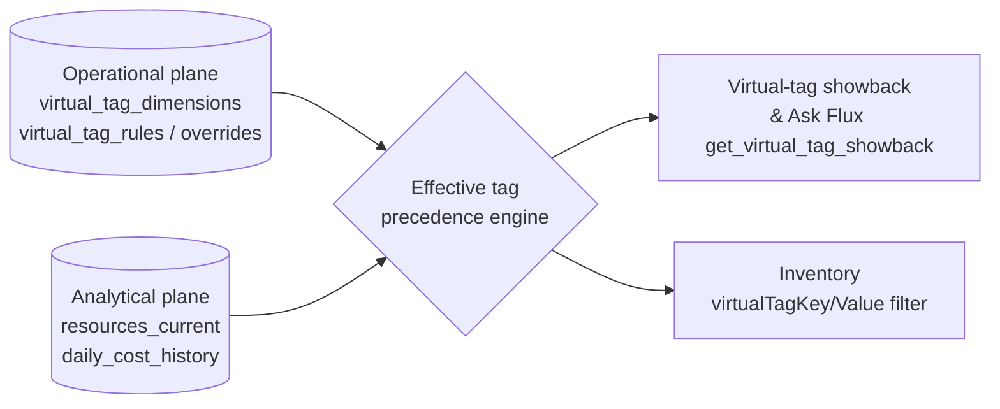

# Flux virtual tags

Last reviewed: 2026-08-09
Implementation: `api/virtual_tags.py` (validation), `api/database.py` (evaluation), `api/operational_store.py` (storage)

## Purpose

Virtual tags are governed business metadata stored in Flux. They make cost and inventory classifiable even when Azure native tags are absent, inconsistent, inherited from another source, or not yet approved for write-back. They are not automatically written to Azure.

Flux now treats virtual tags as first-class reporting dimensions. Administrators manage dimensions and rules under **Administration → Configuration → Virtual tags**. Readers use them under **Reports → Governance & allocation → Virtual tag showback**.

## Two-plane placement

| Object | Plane | Why |
|---|---|---|
| `virtual_tag_dimensions` | Operational (PostgreSQL / operational DuckDB) | Admin-managed metadata; must survive analytical snapshot restores |
| `virtual_tag_rules` + `virtual_tag_rule_audit` | Operational | Versioned, audited business policy — not derived evidence |
| `virtual_tag_overrides` (manual + imported) | Operational | Resource-specific assignments with optimistic-concurrency rollback |
| Effective virtual tag evaluation | Derived at read time from operational rules + analytical `resources_current` | Re-evaluation happens on every report/inventory query, not at snapshot time |
| Virtual-tag cost allocation | Analytical (`daily_cost_history` + `resources_current` join at query time) | Uses current-state reclassification — see limitations below |

Operational state is therefore durable across analytical snapshot publication/restore, while the cost allocation view is always computed from the freshest inventory + cost evidence.

## Data model

- **Dimension**: a reusable business axis such as `BusinessRegion`, `CostCenter`, `Application`, `Owner`, or `Environment`.
- **Rule**: an effective-dated, prioritized include or exclude assignment for a dimension.
- **Override**: a resource-specific manual or imported assignment.
- **Native tag**: the tag inventoried from Azure. It remains the lowest-precedence fallback.

Effective-value precedence is:

1. Manual override
2. Imported override
3. Matching virtual-tag rule, lowest numeric priority first
4. Azure native tag

An exclusion rule can suppress a rule-derived assignment. It never deletes or conceals a manual, imported, or native value.

## Rule criteria

Rules support nested condition groups. A group can require all members (`AND`) or any member (`OR`). Groups can contain conditions and child groups. Comparisons are case-insensitive.

Supported fields:

- Subscription ID and subscription name
- Resource group
- Resource type
- Azure region
- Resource name
- Native tag key/value
- Service name
- Meter category, when the evaluated source exposes it
- Billing scope, when the evaluated source exposes it

Supported operators:

- `equals`
- `not_equals`
- `contains`
- `starts_with`
- `in`
- `exists`
- `not_exists`

Unknown fields and operators fail closed. Empty groups do not match. Legacy rules using `subscriptionIds`, `resourceGroups`, `resourceTypes`, `regions`, `nameContains`, `namePatterns`, `tagEquals`, and `tagExists` continue to evaluate unchanged.

## Preview and lifecycle

Preview is read-only and returns the affected-resource count, total inventory count, a resource sample, and current monthly ActualCost for matching resources. Saving creates a version; later edits, activation, and deactivation increment the version and append rule audit records (`virtual_tag_rule_audit`). Delete in the UI is a reversible soft delete (`inactive`).

Rules may have `effectiveFrom` and `effectiveTo` dates. Inactive or out-of-window rules do not participate in evaluation.

## Reporting behavior

The Virtual tag showback provides:

- Dimension and value filters
- Historical/current cost totals by value
- Classified and Unclassified cost
- Monthly trend lines
- Resource-level cost and assignment provenance
- Links from resources to Inventory
- CSV export

Ask Flux exposes the same governed data through `get_virtual_tag_showback`, so questions such as "show amortized cost by BusinessRegion" use the report contract rather than invented SQL. Inventory questions can also pass `virtualTagKey` and `virtualTagValue` to the governed inventory tool (`search_inventory`).

Cost allocation uses effective virtual tags, so an allocation key configured under Administration can refer to a virtual dimension. This is what permits migration from subscription-as-region to a governed `BusinessRegion` dimension without first writing native Azure tags.

Historical charge rows are evaluated through current inventory and the current rule set. Flux intentionally labels charge rows with no resolvable resource as `Unclassified`. This is current-state reclassification, not slowly-changing historical tag reconstruction. The report exposes that limitation in its lineage note.

## API

Reader endpoints:

- `GET /api/virtual-tags/dimensions`
- `GET /api/virtual-tags/effective?resourceId=...`
- `GET /api/reports/virtual-tags`
- `GET /api/reports/virtual-tags/export`

Administrator endpoints:

- `POST /api/virtual-tags/dimensions`
- `DELETE /api/virtual-tags/dimensions/{key}`
- `GET|POST /api/virtual-tags/rules`
- `POST /api/virtual-tags/rules/{id}/status`
- `DELETE /api/virtual-tags/rules/{id}`
- `POST /api/virtual-tags/preview`
- `POST /api/virtual-tags/overrides/import`
- `POST /api/virtual-tags/overrides/rollback`

Report query parameters are `dimension`, `value`, `costType`, `startDate`, and `endDate` (currency is selected per the governing report contract).

## Scoring and telemetry note

Virtual-tag assignment itself is not scored, but downstream right-sizing confidence and anomaly severity that use telemetry coverage are affected by whether the resources behind a virtual-tag value have recent `telemetry_metric_summaries`. A `BusinessRegion` slice with many uncovered resources will show lower confidence on its optimization candidates.

## Native Azure tags versus virtual tags

Virtual tags are not merely a count of resources awaiting Azure write-back. One resource can have several virtual dimensions, imported worksheets can produce many resource/key assignments, and rules can classify inventory dynamically without persisting one row per match. Consequently, virtual assignment counts can be much larger than a native-tag deployment candidate count.

Native write-back is a separate governed workflow. It requires an approved scope, a dry-run plan, exact pre-change capture, permission checks, and an optimistic rollback. Flux reporting does not depend on native write-back.

## Operational notes

- **Build:** `2.0.0` + `ca66a85` (`version.json` stamped in `azure-pipelines.yml`).
- **Pipeline safety-net** reapplies `FLUX_HOST`/`FLUX_PORT`/`WEBSITE_SKIP_RUNNING_KUDUAGENT`/`FLUX_AUTH_MODE` on every deploy; `GET /config/appsettings` returning `{}` (2026-08-08) must not be used for read-modify-write.
- **Ports:** dev `8765` / Rill `8786` / prod `8000` (see `docs/architecture.md`).
- **Snapshot mode:** virtual-tag rules/overrides are operational (survive snapshot restores); cost allocation is derived at query time from analytical snapshots.

## Deployment and rollback

Application deployment follows the normal `main` Azure DevOps pipeline. Schema initialization is additive:

- Creates `virtual_tag_dimensions` if absent (operational plane).
- Adds `virtual_tag_rules.effect` with default `include` if absent.
- Retains existing rules, audits, and overrides.

Application rollback is a normal redeploy of the prior commit. The additive columns and dimension table can remain safely because old application versions ignore them. Do not drop them during rollback. Imported assignment rollback remains the separate optimistic-concurrency procedure in the [production deployment guide](/docs/VIRTUAL-TAG-PRODUCTION-DEPLOYMENT.md).

## Known limitations and next evolution

- Historical classification uses current effective tags; point-in-time assignment snapshots are not yet materialized (requires effective-dated journals on the analytical plane).
- Meter category and billing scope only match when those fields are present in the evaluated record.
- CSV is the canonical complete export. Excel can open it directly; native multi-sheet XLSX remains a reporting enhancement.
- The UI edits one AND/OR group. The API evaluator supports nested groups for integrations and future UI expansion.
