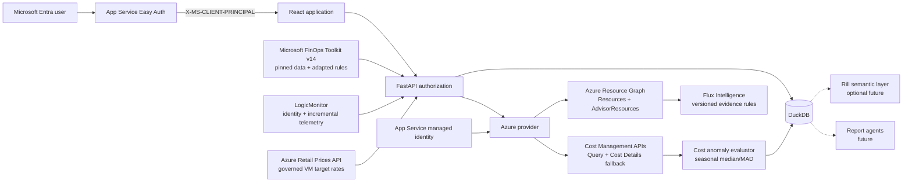

# Architecture

Flux v2 is intentionally narrow: collect Azure inventory, persist it as an analytical history, and turn available signals into a useful dashboard and explainable opportunities.

## Design principles

1. **One job:** create a trustworthy, queryable picture of the Azure estate.
2. **Snapshot, do not overwrite:** every successful collection appends to `resource_snapshots`; `resources_current` presents the newest record per Azure resource ID.
3. **Enrichment is additive:** cost, utilization, opportunity, source, and savings fields are nullable. Providers can populate them independently without changing resource identity.
4. **Explain findings:** Advisor and Flux Intelligence findings carry source, type, evidence, confidence, and a human-readable reason. A resource may have multiple findings.
5. **Keep the UI modular:** Overview, Inventory, Opportunities, and Integrations are lazy-loaded React pages.
6. **Keep analytics portable:** DuckDB is the direct application database and a future source for Rill or governed LLM reporting.

## Active components

### React client

The Vite/TypeScript client is in `frontend/`. It owns presentation and calls the same-origin `/api` contract. Recharts renders dashboard visualizations. There is no browser persistence or business logic.

### FastAPI

The Python API is in `api/`. It exposes session, health, overview, inventory, opportunity, and Azure integration routes. App Service validates the end-user token; Flux decodes the injected principal claims and applies reader/admin authorization. The API persists interactive sync requests and returns immediately; it does not own the production collection process.

### Durable synchronization worker

A singleton continuous App Service WebJob claims persisted `sync_runs` requests
under the sync execution lease. Scheduled and interactive requests use the same
queue and orchestration path. A worker replacement recovers a request left in
`running` once it acquires the released execution lease. Local development runs
the identical consumer loop in embedded mode.

Source schedules enqueue focused requests instead of launching competing writers:
inventory runs daily at 10:00 UTC, Flux Intelligence at 10:30 UTC, Cost Management
at 11:00 UTC, and Advisor every six hours. `sync_source_runs` checkpoints every
source and subscription/cost-type scope. Recovery skips successful child scopes,
while a later scope can fail without rolling back data already committed by its
siblings. The worker serializes DuckDB persistence; the collection lifecycles and
freshness policies remain independent.

A separate singleton cost-history WebJob runs daily at 12:30 UTC. Its first
successful scope fetches 90 days; later runs replace only a 14-day rolling window.
The collector groups daily Cost Management Query results by Resource ID and
Service Name—the API's two-grouping limit—and checkpoints each subscription and
cost type independently. Persistent throttling delays only that source and the
last complete daily rows remain queryable. A shared file-backed request gate
paces all cost processes by the estimated query-processing units for the date
range and persists Azure's throttle-until time across workers. Retry handling
honors the Cost Management QPU, entity, client-type, and standard retry headers.
Missing and failed scopes run first, with never-collected commitment scopes
ahead of healthy cost refreshes. An ad-hoc Azure metadata synchronization
deliberately does not launch a competing cost sweep.

When a daily Query API scope still fails after governed retries, the same WebJob
queues a bounded Generate Cost Details fallback. Each request stays within one
calendar month, follows Azure's asynchronous `Location` and `Retry-After`
contract, aggregates the downloaded CSP charge rows to Flux's daily
resource/service grain, and commits that month independently. Current-month
checkpoints refresh every seven days; at most four reports run per daily job.
Signed report URLs are consumed transiently and are never stored or logged.

After collection, the evaluator ignores the newest two billed days by default,
compares each subscription, service, and resource with up to eight prior matching
weekdays, and scores increases using median absolute deviation. A scope stays
`warming_up` until it has at least 28 days of history and four comparable weekday
points. Normal results are not materialized; anomaly evidence and compact
subscription/service warm-up states retain the method version and evaluation date.

### DuckDB

DuckDB stores:

- Azure integration configuration;
- synchronization history;
- append-only resource, cost, Advisor recommendation, and Flux Intelligence finding snapshots;
- checkpointed daily actual and amortized cost plus method-versioned anomaly runs and findings;
- durable Cost Management request attempts, retry delays, per-scope completion,
  and failed-first recovery ordering;
- current inventory, cost, and recommendation **materialized tables** (not views)
  refreshed after each snapshot write and on startup; the four hottest projections
  (`resources_current`, `costs_current`, `commitment_costs_current`,
  `policy_posture_current`) are `CREATE OR REPLACE TABLE` for O(1) lookup
  instead of recomputing `arg_max` window functions on every read;
- versioned multi-finding rule observations rather than one opportunity column per resource;
- persisted, method-versioned opportunity confidence derived from finding history, source corroboration, freshness, and coverage-aware telemetry evidence;
- persisted, method-versioned opportunity valuation using Advisor estimates or explicitly eligible full-retirement findings projected from resource-level amortized cost;
- consecutive-snapshot inventory drift with governed fingerprints and scope-level median/MAD change-volume baselines;
- multi-source VM classification recomputed after telemetry runs, with no-data/warming-up/partial/conflicting states retained alongside actionable results;
- raw ARG, Advisor, and rule-evidence JSON for later investigation or agent queries.
- assignment-level and resource-level Azure Policy states for read-only
  compliance and exemption drilldown.
- checksum-pinned Microsoft FinOps Toolkit reference mappings, import provenance,
  and upstream attribution for adapted rules.

The DuckDB version is **exact-pinned** (`duckdb==1.4.5` in `requirements.txt`)
to prevent consecutive deploys from resolving to different patch builds.
A floating range (`>=1.3,<1.5`) caused five corruption incidents in five days
when different engine builds wrote and checkpointed the same on-disk file.

### Azure provider

The Azure provider has two identity implementations:

- local development uses the signed-in Azure PowerShell context;
- Azure hosting uses `ManagedIdentityCredential`.

One synchronization collects:

1. paginated Azure resources from the ARG `Resources` table;
2. active, untracked Cost and Performance recommendations from the ARG
   `AdvisorResources` table;
3. branded Flux Intelligence findings from read-only ARG rule packs;
4. subscription-scoped `ActualCost` and `AmortizedCost` month-to-date resource results from the Cost Management Query API;
5. actual month-to-date usage cost grouped by the supported `ResourceGuid` and
   `PricingModel` dimensions. `ResourceGuid` is normalized to Flux's internal
   meter identifier before it is joined to the pinned FinOps Toolkit eligibility
   reference;
6. checkpointed Actual and Amortized Cost Details reports used only to fill
   daily-history scopes that the Query API could not complete.

Inventory, Advisor, Flux Intelligence, and cost are independent sources. A failure is recorded against its exact scope and does not discard a successful prior snapshot. `source_sync_state` advances only a scope that completed, so a failed rule pack retains the previous complete Flux Intelligence set and a throttled subscription retains its previous good cost view. Cost Management honors Azure retry guidance with QPU-aware pacing and exponential fallback, retries unfinished scopes first, and continues collecting later scopes after a persistent failure.

Advisor recommendations are semantically de-duplicated before storage using
scope, resource, recommendation type, action, and target context. The
Opportunities projection applies a second defensive semantic de-duplication
while preserving distinct subscription-level commitment variants. Flux only
collects active Advisor Cost and Performance recommendations; Security,
Reliability, and Operational Excellence remain in their authoritative Azure
services instead of inflating the FinOps opportunity portfolio.

The commitment dashboard is intentionally a directional cost mix. It compares
non-negative actual usage cost on eligible meters across On-demand, Reservation,
and Savings Plan pricing models. Discounted billed cost is not equivalent to
benefit utilization, so Flux does not label this result as utilization. True used
and unused commitment reporting remains gated on charge-level cost details.

The API projects source health using **schedule-aware staleness**: a source is
only stale when the last expected scheduled run has been missed plus a grace
window (4h for daily, 2h for interval sources), not merely because a fixed
age threshold was exceeded. A hard backstop (`stale_after_hours`) still applies
to sources without a schedule. Unprovisioned sources (never synced) do not
trigger the warning banner. Dashboard and Opportunities warn when evidence is
stale or degraded, while the Administration page shows the schedule, current
row count, completed/expected scopes, last attempt, and whether last-good data
is being served.

System-assigned identity requires no client ID. Set `FLUX_MANAGED_IDENTITY_CLIENT_ID` when the App Service has multiple identities and Flux should select a user-assigned identity.

## Identity boundaries

Flux keeps the two identities separate:

- **Easy Auth / Entra user identity** controls who can view inventory and who can change or synchronize integrations.
- **Managed identity** controls what subscriptions the application itself can query.

The `Flux.Reader` app role can read dashboards, inventory, and opportunities. `Flux.Admin` includes read access and can manage or synchronize the Azure integration. Role or group claim values can be remapped with environment settings.

The application trusts `X-MS-CLIENT-PRINCIPAL` only because App Service removes external copies and injects its validated value. Do not expose an Entra-configured Flux process through a route that bypasses App Service Authentication.

All DuckDB connections, including read-only API queries, acquire one
cross-process lease because DuckDB does not allow a process writer while another
process holds the file read-only. Independent WebJobs retain separate execution
locks, while transient external lock holders receive bounded connection retries.
The PostgreSQL operational store (`OperationalStore`) uses a bounded connection
pool (default 8, configurable via `FLUX_OPERATIONAL_POOL_SIZE`) with checkout
ping and clean read-only release; idle connections are reused instead of
re-handshaking TLS on every call.

Valuation never infers a missing SKU price. For VM right-sizing, Flux requires an
explicit Azure Advisor target SKU and an unambiguous primary hourly consumption
meter from the Azure Retail Prices API. Spot, Low Priority, non-VM, tiered, and
multiple-distinct-rate matches are rejected. Windows license-included and Azure
Hybrid Benefit profiles are selected independently. The current resource side is
the normalized amortized (or actual fallback) Cost Management run rate; the target
side is a separately labeled Microsoft retail rate projected at 730 hours/month.
Azure Advisor estimates remain the fallback and retain Advisor lineage. Flux
Intelligence values only full-retirement findings with resource-level Cost
Management evidence. Risk-adjusted value is gross value multiplied by persisted
evidence confidence.

Right-sizing similarly refuses to infer a VM SKU. A shutdown candidate requires a
complete CPU, memory, and bidirectional network window, including CPU-maximum and
memory guardrails. A resize candidate additionally requires Azure Advisor to
supply the target SKU. Historical LogicMonitor and Azure Monitor summaries are
imported independently with their original collection windows and aggregation
lineage. Flux uses the more conservative observed values and routes material CPU
disagreement to review rather than averaging unlike metric semantics.

LogicMonitor discovery remains separate from metric collection. The metric job
selects the least-recently-checkpointed matched devices, reads only a bounded
incremental window, deduplicates raw observations, and advances a device
checkpoint only after every requested datasource completes. Rolling 14-day
summaries use distinct observed hour buckets for coverage and retain 30 days of
raw samples. The imported baseline remains preferred until an incremental window
has matured, preventing a short first run from replacing governed history.

## Next adapters

- **Contracted price:** add agreement-specific rates without relabeling them as retail or actual billed cost.
- **Rill runtime:** the read-only models, measures, explores, and parity tests
  are implemented; hosting the optional runtime remains an operator choice and
  is not an application dependency.
- **Flux Intelligence:** authenticated users can query the governed catalog,
  reports, inventory, opportunities, and documentation through bounded,
  read-only Flux tools. Responses request enforced JSON, receive one
  formatting-only repair when necessary, and fall back to safely rendered
  plain text rather than failing the user request. Prompts, validated replies,
  raw final responses, response mode, tool timing, and end-to-end performance
  remain available for administrator quality review.

## Current operational boundary

The user authorization, managed-identity ARG path, durable synchronization worker,
Key Vault-backed external credentials, backup retention, and deployment automation
are implemented. Before broader cloud production, add centralized observability,
regularly test database restoration, and introduce an appropriate shared operational
store before enabling multiple active application instances.
