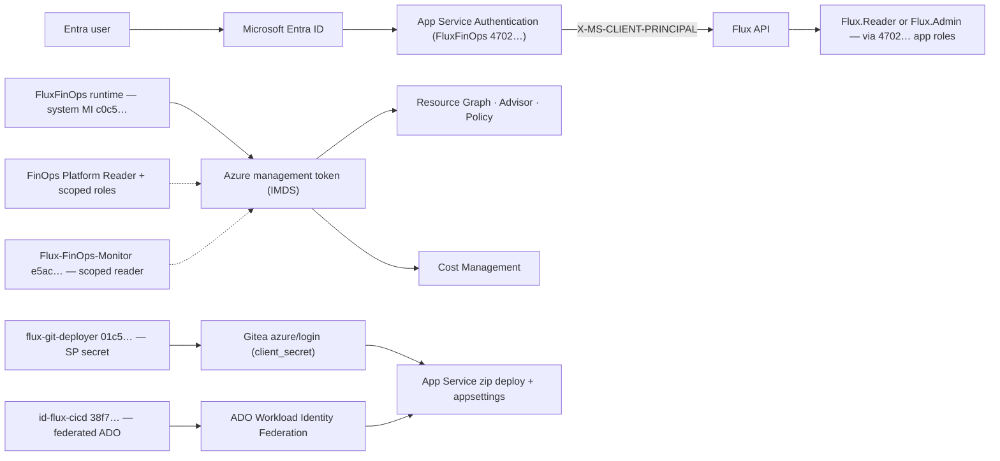

# Entra authorization and managed-identity ARG access

> **Build `2.0.0` · `8d600c4`** (current `main` 2026-08-14; prior `840e20f` · `ca66a85`) — the running artifact's commit is baked in `version.json` (`azure-pipelines.yml` stamps `frontend/dist/version.json` + `version.json` from `$(Build.SourceVersion)`) and resolved as `settings.build_commit` (`api/config.py: _resolve_build_commit()`). Verify with `GET /api/health` (`commit`) and `GET /api/session` (`build: {version, commit}`); the UI surfaces it in the Shell header chip + footer. Pipeline additive safety-net keys (`FLUX_HOST`, `FLUX_PORT`, `WEBSITE_SKIP_RUNNING_KUDUAGENT`, `FLUX_AUTH_MODE`) restore auth/hosting after any settings wipe.

Flux separates user authorization from Azure service authorization.

| Flow | Identity | Mechanism |
|---|---|---|
| User → Flux | Microsoft Entra user or group | App Service Authentication and `X-MS-CLIENT-PRINCIPAL` |
| Flux → Azure Resource Graph and Advisor | App Service managed identity (`FluxFinOps` runtime `c0c5…`) | `ManagedIdentityCredential` and Azure RBAC |
| Flux → Cost Management | App Service managed identity (`FluxFinOps` runtime `c0c5…`) | `ManagedIdentityCredential` and `Microsoft.CostManagement/*/read` |
| Flux → App Service deploy | Gitea SP secret (`flux-git-deployer` `01c5…`) — ADO stays federated | `azure/login@v2` with `AZURE_CLIENT_SECRET` (Gitea) / Workload Identity Federation (ADO) |

### Why three planes — plus two job identities

* **Auth plane — `FluxFinOps` (`4702…`) — proves WHO you are.** Entra App Registration that owns App Service Authentication and defines `Flux.Reader` / `Flux.Admin` app roles. No Azure RBAC — by design. If this breaks, users can't log in, but the app can still read Azure.
* **Runtime plane — `FluxFinOps` (`c0c5…`) — proves WHAT the app can read.** System-assigned managed identity of the `FluxFinOps` App Service. Holds `FinOps Platform Reader` on the management group, `Log Analytics Reader`, scoped Storage/KV/BLOB roles. No login — the app gets tokens via Instance Metadata Service (IMDS). If this breaks, login works but data planes go `403`/empty.
* **Deployer plane — two identities, same scope, different auth:**
  * `flux-git-deployer` (`0f14e136…` / `3155e7c1…`) — Entra App with a client secret (`git-20260814`, expires 2027-08-14), used **only by Gitea** (`owner/flux` → `azure/login@v2` + `Website Contributor` on the single App Service). Secret is stored as `AZURE_CLIENT_SECRET` in Gitea — Cloud Shell can't reach Gitea, so copy via an ephemeral `~/.deleteme` then `shred`.
  * `id-flux-cicd` (`7f576dc7…` / `448de4b5…`, UAMI in `prod-example-westus3-rg`) — federated OIDC, used **only by ADO** (`flux-prod-wif`). Keeps two federated credentials (`azure-devops-fluxfinops` + `git-flux-main`). No secret. ADO has no free minutes right now, so Gitea is the active deployer.
* **Monitor — `Flux-FinOps-Monitor` (`e5ac…`)** — ops health/probe. `Reader` on the sub + `Website Contributor` (read/restart, not deploy) + scoped Key Vault secret. Also the **only** SP that holds the `Flux.Admin` (`ac6a43d5…`) appRoleAssignment against `FluxFinOps (4702…)` — that's why `flux.example.com/api/operations/pipeline` with its token works.
* **Export provisioner — `Flux-FinOps-Export-Provisioner` (`3d04…`) — deleted 2026-08-14.** Was a one-shot provisioner for 13 Focus exports (`focus-daily` + 12 backfills) on `prodfinopswestus3sa`. Had no credentials at delete, exports continue without it. Not part of Flux runtime.

Two objects both called `FluxFinOps` are **intentionally different planes** (`4702…` auth app vs `c0c5…` system MI). Do not migrate RBAC between them — see "Don't conflate" below.



### Live identities (verified 2026-08-14)

Source: `az ad sp list --filter "startswith(displayName,'Flux') or startswith(displayName,'flux')"` as `admin@example.com` after `az login` + `az role assignment list` + `az identity federated-credential list` — 01:27 dump, plus Focus-exports `01:40` verification and `flux-git-deployer` creation (01:40–05:56).

| Purpose | Entra name / Type | AppId / ClientId | ObjectId / PrincipalId | How it authenticates |
|---|---|---|---|---|
| **Runtime reader** | `FluxFinOps` — **ManagedIdentity** (System-assigned on App Service) | `c52a06c3-b43d-4c74-a09d-b5c0c590e8d9` | `2f6fc63d-db17-47d1-a120-f4933294e60f` | No secret — `ManagedIdentityCredential` via IMDS. `az ad app show --id c0c5…` correctly errors `Resource does not exist` (it is not an App Registration). |
| **Auth plane only** | `FluxFinOps` — **Application** (App Registration, Entra app) | `8bb2139c-8875-4594-af15-d55d3d115c14` | `5ebe1b8e-5498-4f27-af47-49aa8624fa76` | No Azure credential — App Service Easy Auth validates user tokens against this `appId` as the audience. Owns `Flux.Reader` / `Flux.Admin` app roles. |
| **Deploy — Gitea (active)** | `flux-git-deployer` — **Application** | `82131e51-3543-4b8f-ac38-0f3bb857fafb` | `8669061c-128e-46b8-afaf-a9f92ce65915` | SP secret `git-20260814` (expires **2027-08-14**, `7c5e9dc3…`), stored as `AZURE_CLIENT_SECRET` in `owner/flux` Gitea. No `Sites.Contributor` beyond the single App Service. |
| **Deploy — ADO (reserved)** | `id-flux-cicd` — **ManagedIdentity** (User-assigned, `prod-example-westus3-rg`, westus3) | `33333333-3333-3333-3333-333333333333` | `44444444-4444-4444-4444-444444444444` | Federated — no secret. Two federatedIdentityCredentials (see below); ADO quota is paused but identity remains. |
| **Ops monitor** | `Flux-FinOps-Monitor` — **Application** | `f589122a-b275-49a5-a86c-fe69b44e859c` | `549454ab-ba8f-4165-ad93-e270a8a00cb3` | No stored secret shown at last dump; also holds the `Flux.Admin` (`ac6a43d5…`) appRoleAssignment against `4702…` — required for `flux.example.com/api/operations/pipeline` with this SP's token. |
| **Deleted 2026-08-14** | `Flux-FinOps-Export-Provisioner` — **Application** (deleted) | `dbab2302-620e-4c87-a7e3-5e63b7f06e03` *(deleted)* | `704c6f50-2dde-499a-a4d0-92a99058d315` *(orphaned SP)* | Was one-shot provisioner — created 13 Focus exports on `prodfinopswestus3sa`, had no credentials at delete. |

**Orphans / deduped `Flux-FinOps-Monitor` (already cleaned — do not recreate):**

| DisplayName | Id | State | Action |
|---|---|---|---|
| `Flux-FinOps-Monitor` old cert | `d77a3468-2019-4be0-ada9-e49f7d0dc65b` | Gone — `does not exist` | `az ad sp delete --id a5a2b…` (had `Flux-Gitea-Deployer` cert double-provisioned). |
| Duplicate by objectId | `5e8ba334-09db-4992-a20f-e3eaeec899cf` | Gone/disabled | `az ad sp update --id 9e8a… --set accountEnabled=false`, awaiting purge. |
| `Flux-FinOps-Export-Provisioner` | `3d04…` / `aa5139…` | Deleted 2026-08-14 | Blank credentials, 13 exports remain — verified before delete. |

**Federation detail (ADO MI only):**

| Federated credential name | Issuer | Subject | Audience |
|---|---|---|---|
| `azure-devops-fluxfinops` | `https://login.microsoftonline.com/00000000-0000-0000-0000-000000000000/v2.0` | `/eid1/c/pub/t/s0x6TLTrs0-6p6Zdl3VXfw/a/rISbSSETf0KqFyZ8ppdXmA/sc/2b6e654e-9917-4ef0-a911-7bd6c4a6edf7/41c47532-8822-4ddd-a694-bbd176dc6422` | `api://AzureADTokenExchange` |
| `git-flux-main` | `https://git.example.com` | `repo:owner/flux:ref:refs/heads/main` | `api://AzureADTokenExchange` |

`git-flux-main` is the `git` standard name (was `gitea-flux-main` before 2026-08-14). Created 2026-08-12; verified `az identity federated-credential list --identity-name id-flux-cicd`. The Gitea deploy no longer uses it — `flux-git-deployer` secret does.

### RBAC — which scope each identity can touch

Scopes are subscriptionId-qualified — never rely on displayName (`Production` appears 6×). Authoritative from the 01:27 `az role assignment list --assignee … --all` dump (run after `az login` as you, not as the SP).

| Identity | Role | Scope | Note |
|---|---|---|---|
| **Runtime `c0c5…` (6 grants)** | `FinOps Platform Reader` *(custom: `Microsoft.CostManagement/*/read` + `Microsoft.ResourceGraph/resources/read`)* | `/providers/Microsoft.Management/managementGroups/00000000-0000-0000-0000-000000000000` | MG-wide Cost/Graph read — why runtime answers tenant-wide without per-sub grants. |
| | `Log Analytics Reader` | `…/resourceGroups/prod-monitoring-westus3-rg/providers/Microsoft.OperationalInsights/workspaces/prod-monitoring-westus3-law` | Runtime log queries. |
| | `Reader` + `Storage Blob Data Reader` | `…/storageAccounts/prodfinopswestus3sa` | Reads `cost-management` container + `stfluxprod/blobServices/default/containers/cost-management` (and `fluxfinopsbackup` for inventory). |
| | `Key Vault Secrets User` (vault-scoped) | `…/vaults/kv-flux-prod` | Reads `FLUX_*` secrets; Monitor `e5ac…` is scoped to single secret `agent-database-url` instead. |
| | `Storage Blob Data Contributor` | `…/storageAccounts/fluxfinopsbackup` | Writes snapshots / backup blobs. |
| | `Reader` (second `Reader` above is Blob Reader) | `…/storageAccounts/prodfinopswestus3sa` | Storage account itself. |
| **Monitor `e5ac…` (4 grants)** | `Reader` | `/subscriptions/ad88f5c9…` | Sub-wide read for health / `flux.example.com/api/operations/pipeline`. |
| | `Website Contributor` | `…/sites/FluxFinOps` | Read site config / restart — not deploy (`Contributor` would deploy). |
| | `Storage Blob Data Reader` | `…/storageAccounts/prodfinopswestus3sa` | Validates cost blobs. |
| | `Key Vault Secrets User` (secret-scoped) | `…/vaults/kv-flux-prod/secrets/agent-database-url` | Least-privilege vs runtime's vault-wide. |
| **Git deployer `01c5…` (1 grant)** | `Website Contributor` | `…/sites/FluxFinOps` | Gitea zip-deploy + additive `az webapp config appsettings set`. No Graph/Cost read. Expires with secret `2027-08-14` — if ADO resumes, delete this SP and return to federation. |
| **ADO deployer `38f7…` MI (1 grant)** | `Website Contributor` | `…/sites/FluxFinOps` | Same scope as `01c5…` — one scope, two principals (secret vs federated). No Graph/Cost. Keeps `git-flux-main` for when Gitea 1.28 ships. |
| **Auth `4702…` (0 grants)** | — | — | Correct — Entra app roles only (`Flux.Reader` → read-only, `Flux.Admin` → read + Integrations/sync). Auth is `X-MS-CLIENT-PRINCIPAL`, not ARM. |
| **Deleted `3d04…` (was 4, now orphaned)** | `Cost Management Contributor` etc on `31d9…` / `prodfinopswestus3sa` | `31d9…` | Was broader than Reader (provisioning). Assignments orphaned at delete — clean up after 30d if the 13 Focus exports remain stable. |

> **Don't conflate the two `FluxFinOps`.** `4702…` has **0 Azure RBAC** — migrating `c0c5…`'s MG `FinOps Platform Reader` onto it gives the login plane tenant-wide Cost/Graph read + vault access and leaves the App Service MI with nothing (login works, data goes red). `c0c5…` has **no App Roles** — deleting `4702…` breaks login. Same `displayName` by history, different `servicePrincipalType` (`Application` vs `ManagedIdentity`).

> Full dump: `docs/PRIVATE-ACCESS-AND-IDENTITY-RUNBOOK.md` §12 (verified `az role assignment list --all` + `az identity federated-credential list` on 2026-08-14).

## 1. Configure Microsoft Entra app roles

On the app registration used by App Service Authentication (`FluxFinOps` `3f7a136d…`, enterprise app `3f43ede1…`), define:

| Display name | Value | Allowed member types |
|---|---|---|
| Flux Reader | `Flux.Reader` | Users/Groups |
| Flux Administrator | `Flux.Admin` | Users/Groups |

Assign users or groups through the enterprise application (`3f43ede1…`).

Flux maps:

- `Flux.Reader` to read-only application access;
- `Flux.Admin` to read access plus Azure integration configuration and synchronization.

Role values can be replaced or extended with comma-separated app-role values or group object IDs:

```text
FLUX_ENTRA_ADMIN_ASSIGNMENTS=Flux.Admin,<admin-group-object-id>
FLUX_ENTRA_READER_ASSIGNMENTS=Flux.Reader,<reader-group-object-id>
```

## 2. Enable App Service Authentication

In the Web App (`FluxFinOps`, `prod-example-westus3-rg`):

1. Open **Authentication**.
2. Add Microsoft as the identity provider using the Flux auth app (`FluxFinOps` `3f7a136d…` / `3f43ede1…`).
3. Require authentication.
4. Redirect unauthenticated browser requests to Microsoft.
5. Restrict the issuer to the expected tenant (`00000000-0000-0000-0000-000000000000` / `example.COM`).
6. Configure the app so untrusted traffic cannot bypass the App Service authentication layer.

Application settings:

```text
FLUX_AUTH_MODE=entra
FLUX_ENTRA_TENANT_ID=<tenant-guid>
FLUX_ENTRA_ADMIN_ASSIGNMENTS=Flux.Admin
FLUX_ENTRA_READER_ASSIGNMENTS=Flux.Reader
FLUX_AUTH_LOGIN_PATH=/.auth/login/aad
FLUX_AUTH_LOGOUT_PATH=/.auth/logout
```

App Service validates the user token and injects a Base64-encoded claims document in `X-MS-CLIENT-PRINCIPAL`. Flux:

1. decodes the document;
2. validates the tenant claim when `FLUX_ENTRA_TENANT_ID` is configured;
3. maps role and group claims;
4. returns the resolved session from `/api/session`;
5. enforces reader/admin dependencies on API routes.

The frontend hides Integrations from readers, but the API authorization checks are the security boundary.

## 3. Enable managed identity

### System-assigned (Flux runtime `c0c5…`)

The running App Service `FluxFinOps` already has a system-assigned identity — `az webapp identity show --name FluxFinOps -g prod-example-westus3-rg` returns `principalId 8a718959… / clientId a0ff40e9…`. No `FLUX_MANAGED_IDENTITY_CLIENT_ID` needed — leave it unset so `ManagedIdentityCredential` picks the system MI.

Verify: `az role assignment list --assignee c52a06c3-b43d-4c74-a09d-b5c0c590e8d9 --all` should show the 6 roles above.

### User-assigned (ADO deployer `38f7…`)

Only for deployment — not for runtime. `id-flux-cicd` (`7f576dc7…`) stays assigned to the site for ADO's `flux-prod-wif` Workload Identity Federation (`azure-devops-fluxfinops` + `git-flux-main`). Not referenced by `FLUX_MANAGED_IDENTITY_CLIENT_ID`.

If you ever add a second runtime UAMI, set:

```text
FLUX_MANAGED_IDENTITY_CLIENT_ID=<user-assigned-client-id>
```

This explicitly selects which user-assigned identity the app uses when multiple are assigned. For today's single system MI, don't set it.

## 4. Grant Azure Resource Graph access

The **runtime** `c0c5…` already has `FinOps Platform Reader` on management group `96f91166…` (covers `Microsoft.ResourceGraph/resources/read` tenant-wide) + `Log Analytics Reader` on `prod-monitoring-westus3-law`. No per-subscription `Reader` needed — the MG grant inherits to all Enabled subs under `contoso-mg` etc.

If you need to add a new subscription outside the MG, grant:

```powershell
az role assignment create `
  --assignee-object-id 2f6fc63d-db17-47d1-a120-f4933294e60f `
  --assignee-principal-type ServicePrincipal `
  --role Reader `
  --scope /subscriptions/<subscription-guid>
```

For a new MG, assign `FinOps Platform Reader` there instead of per sub. The custom role includes:

```text
Microsoft.CostManagement/*/read
Microsoft.ResourceGraph/resources/read
```

Flux also uses scoped grants: `Reader` + `Storage Blob Data Reader` on `prodfinopswestus3sa`, `Key Vault Secrets User` on `kv-flux-prod`, `Storage Blob Data Contributor` on `fluxfinopsbackup`. Keep this read-only — Flux does not create budgets, exports, reservations, or Azure resources.

RBAC assignments can take several minutes to propagate.

## 5. Select the provider

In **Integrations**:

1. add the tenant and subscription scopes;
2. select **App Service managed identity** (`c0c5…` system MI — no client ID prompt);
3. save;
4. synchronize.

Flux obtains a token for:

```text
https://management.azure.com/.default
```

via `ManagedIdentityCredential` (IMDS) from the runtime `c0c5…` MI. It then submits paginated Resource Graph requests for resources and active Advisor recommendations, followed by subscription-scoped Cost Management Query requests for actual and amortized month-to-date cost. No client secret or user access token is stored.

## 6. Local development

Keep:

```text
FLUX_AUTH_MODE=mock
```

Authenticate Azure PowerShell:

```powershell
Connect-AzAccount
```

Select **Local Azure PowerShell context** in Integrations.

For controlled authorization tests, set `FLUX_AUTH_MODE=entra` and send a locally generated `X-MS-CLIENT-PRINCIPAL` header. Never accept such client-supplied headers on a production route that bypasses Easy Auth.

## Troubleshooting

| Symptom | Likely cause |
|---|---|
| `401` from Flux | Entra mode is enabled but App Service did not inject a principal (check auth app `4702…` / `3f43ede1…` is assigned to the site). |
| `403` with role message | User is authenticated but has no mapped Flux role (`Flux.Reader`/`Flux.Admin` on `4702…` not assigned to user/group). |
| Tenant mismatch | `FLUX_ENTRA_TENANT_ID` does not match the principal tenant claim (`96f91166…`). |
| Managed identity token failure | `c0c5…` system MI not enabled, or `FLUX_MANAGED_IDENTITY_CLIENT_ID` set to wrong UAMI. Clear it for system MI. |
| ARG `403` | `c0c5…` lacks `FinOps Platform Reader` / `Reader` at MG/sub/scope. |
| Empty ARG result | `c0c5…` can authenticate but scope excludes configured subscriptions (check `contoso-mg` inheritance or orphan scope). |
| Cost `403` | `c0c5…` lacks `Microsoft.CostManagement/*/read` (the custom `FinOps Platform Reader`). Check MG grant. |
| Cost `429` | Cost Management throttled the query; Flux retries, preserves completed scopes, and retains previous successful scopes. |
| `3d04…` exports | SP deleted — expected. 13 Focus exports (`focus-daily` + 12 backfills) continue on schedule without it. |

## Deployment and observability

- **Deployers (current):** Gitea `flux-git-deployer` (`0f14e136…`, secret `git-20260814` → `AZURE_CLIENT_SECRET` in `owner/flux`, `Website Contributor` on `FluxFinOps` only, expires `2027-08-14`) is active; ADO `id-flux-cicd` (`7f576dc7…`, federated `azure-devops-fluxfinops` → `flux-prod-wif`) is reserved — no free minutes, build still stamps `version.json` on Gitea. Secret was staged via ephemeral `~/.deleteme` in Cloud Shell → dev host → Gitea API, then `shred`'d (`chmod 600`, `~/flux-sp-tmp/` remains in Cloud Shell — `rm` there).
- **Pipeline stamping is the build source of truth.** `azure-pipelines.yml` / `.gitea/workflows/ci.yml` step "Stamp build version" writes `version.json` (`frontend/dist/version.json` + `version.json`) from `$(Build.SourceVersion)` / `$(GITEA_SHA)`; `settings.build_commit` hydrates from it. The additive `az webapp config appsettings set` step reapplies safety-net keys (`FLUX_HOST=0.0.0.0`, `FLUX_PORT=8000`, `WEBSITE_SKIP_RUNNING_KUDUAGENT=false`, `FLUX_AUTH_MODE=entra`) so a destructive `GET .../config/appsettings`-then-`PUT` wipe (2026-08-08 incident: `GET` returns `{}` even when 29+ keys exist — use `POST .../config/appsettings/list`) self-heals on next deploy.
- **What is deployed:** The `FluxFinOps` App Service runs `python app.py` on `0.0.0.0:8000` (`WEBSITE_RUN_FROM_PACKAGE=1`, `PYTHONPATH` vendored), with `FLUX_SYNC_WORKER_MODE=external` (continuous `flux-sync-worker` WebJob). Local development uses port `8765` (Rill `8786`); DuckDB is single-writer (`writer.lock`/WAL — `CHECKPOINT` before `cp`).
- **Verify the build:** `curl https://flux.example.com/api/health` → `commit: 8d600c4` (for `2.0.0`, prior `840e20f` · `ca66a85`); `curl -H "X-MS-CLIENT-PRINCIPAL: ..." https://flux.example.com/api/session` → `build` + `dataCurrency`; UI Shell header chip (click-to-copy) + footer `v2.0.0 · 8d600c4`.
